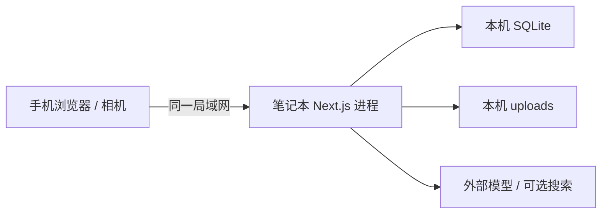

# Production and Local Demo Runbook

状态：基线运行规范  
最后更新：2026-08-28
当前产品真相源：`docs/superpowers/specs/2026-08-28-qiandiao-product-pivot.md`
继承架构参考：`docs/superpowers/specs/2026-08-21-qiandiao-architecture-design.md`、`docs/superpowers/specs/2026-08-27-task-13-feedback-loop-design.md`

## 1. 目的与边界

本文回答四件事：如何配置、如何运行、如何验证、出问题如何恢复。

当前“Production”指一台受控笔记本上的 production build，通过同一 Wi-Fi 或手机热点向手机浏览器提供服务。它是稳定演示形态，不代表互联网公开部署已经安全完备。

当前不支持：

- 把服务直接暴露到公网。
- 多用户并发和账户权限。
- 多实例共享同一 SQLite 文件。
- 在网络文件系统上运行 SQLite。
- 自动云备份、CDN 或对象存储。

如果未来上云，必须先完成第 14 节的迁移门禁，不能把本地 HTTP 方案原样公开。

## 2. 运行拓扑



约束：

- Next.js、SQLite 和上传目录必须在同一台笔记本。
- SQLite 文件必须位于本地磁盘，不放 OneDrive、NAS 或共享盘。
- 手机只访问 Next.js；不接触数据库、文件路径或模型密钥。
- 未启用真实 Provider 时，应用必须进入明确的 fallback 模式，而不是半启动。

## 3. 固定运行版本

| 组件 | 版本策略 |
|---|---|
| Node.js | 24 LTS，使用 `.nvmrc`/`.node-version` 与 `packageManager` 固定 |
| pnpm | 由 `package.json#packageManager` 固定；通过 Corepack 启用 |
| Next.js | 16.x，锁文件固定实际补丁版本 |
| SQLite | 由 better-sqlite3 运行时提供；启动时记录版本但不打印路径 |
| 浏览器 | 当前稳定版 Chrome、Edge 或 Safari |

升级 Node、Next.js、数据库驱动或 sharp 属于发布变更，必须完整跑第 12 节门禁和真实手机测试。

## 4. 配置契约

所有随部署变化的配置使用环境变量。真实 `.env.local` 不提交 Git；仓库只提供 `.env.example`。`DASHSCOPE_API_KEY` 从系统环境变量（如 `~/.zshrc` 的 `export`）读取，不落入项目内任何文件。

计划中的配置 Schema：

| 变量 | 必需 | 示例 | 说明 |
|---|---|---|---|
| `NODE_ENV` | 自动 | `production` | 由运行命令设置 |
| `APP_BASE_URL` | 是 | `http://192.168.1.20:3000` | 手机实际访问地址 |
| `HOSTNAME` | 是 | `0.0.0.0` | 允许局域网访问 |
| `PORT` | 是 | `3000` | 服务端口 |
| `DATABASE_PATH` | 是 | `./data/app.db` | 必须是本机可写路径 |
| `UPLOAD_DIR` | 是 | `./data/uploads` | 必须在 Web 根目录外 |
| `MAX_UPLOAD_BYTES` | 是 | `12582912` | 单图 12 MiB |
| `MAX_IMAGE_PIXELS` | 是 | `40000000` | 单图 40 MP |
| `IMAGE_LONG_EDGE` | 是 | `2048` | 标准化长边 |
| `AI_MODE` | 是 | `fallback` / `qwen` | 启动模式必须显式 |
| `DASHSCOPE_API_KEY` | 条件 | 不写示例密钥 | `AI_MODE=qwen` 时必需；从系统环境变量读取，不写入 `.env.local` |
| `QWEN_BASE_URL` | 条件 | Provider 官方地址 | 服务端使用 |
| `QWEN_RECIPE_MODEL` | 条件 | `qwen3.7-plus` | 配方模型，可替换 |
| `QWEN_VISION_MODEL` | 条件 | 由接入任务确认 | 视觉模型，可替换 |
| `ENABLE_WEB_SEARCH` | 是 | `false` | 搜索不是核心依赖 |
| `SEARCH_TIMEOUT_MS` | 条件 | `2500` | 超时即本地降级 |
| `LOG_LEVEL` | 是 | `info` | `debug/info/warn/error` |
| `DATA_RETENTION_DAYS` | 是 | `7` | 本地清理提示，MVP 不自动删 |

启动时必须用 Zod 一次性校验配置，错误时拒绝启动并只报告缺失变量名，不打印变量值。

安全要求：

- 禁止 `NEXT_PUBLIC_DASHSCOPE_API_KEY` 或任何公开密钥变量。
- 密钥不出现在 URL、日志、错误响应、截图、测试快照和 `decision_events`。
- 泄漏后先吊销/轮换，不以“删掉 Git 中那一行”作为完整修复。
- 公开互联网部署时使用托管秘密系统；本地演示的密钥只允许系统环境变量（`~/.zshrc` 的 `export`），`.env.local` 仅承载非敏感本地配置。

## 5. 首次安装

以下命令在脚手架任务完成后成为标准流程：

```bash
corepack enable
pnpm install --frozen-lockfile
cp .env.example .env.local
pnpm db:migrate
pnpm db:seed
pnpm test
pnpm build
```

Windows 如果 `corepack enable` 因 Node 安装目录权限返回 `EPERM`，可以直接使用 `corepack pnpm <command>`（例如 `corepack pnpm install --frozen-lockfile`）。不要因此修改 `packageManager`，也不要安装随机的全局 pnpm。

Windows 用户如果没有 `cp`，手动复制 `.env.example` 为 `.env.local`。不要把真实密钥写回 `.env.example`。

`pnpm db:seed` 只写可公开的本地 fallback 配方和规则演示数据，不写任何用户照片、真实会话或密钥。

## 6. 开发与 production build

### 6.1 开发模式

```bash
pnpm dev --hostname 0.0.0.0
```

开发模式用于编码和调试，不作为最终演示运行方式。

### 6.2 演示模式

```bash
pnpm build
pnpm start --hostname 0.0.0.0 --port 3000
```

演示前必须使用与演示相同的环境变量完成构建和 smoke test。不要在构建完成后临时更换 `AI_MODE` 而不重跑功能验证。

### 6.3 找到手机访问地址

- Windows：运行 `ipconfig`，找到当前热点或 Wi-Fi 适配器的 IPv4 地址。
- macOS/Linux：在网络设置中查看当前连接的 IPv4 地址；也可用 `ip addr`。
- 手机打开 `http://<笔记本IPv4>:3000`。

如果手机无法访问，按顺序检查：

1. 手机和笔记本是否在同一网络。
2. 服务是否绑定 `0.0.0.0`，而不是只绑定 `localhost`。
3. `http://127.0.0.1:3000/api/health` 在笔记本是否正常。
4. 操作系统防火墙是否只在“专用/私有网络”允许 Node.js 或 TCP 3000。
5. 热点是否启用了客户端隔离。

不要为了排错永久关闭系统防火墙，也不要添加“所有网络、所有端口”的宽泛规则。

## 7. 健康检查与就绪定义

### 7.1 `GET /api/health`

健康检查返回：

```json
{
  "status": "ok",
  "checks": {
    "database": "ok",
    "uploads": "ok",
    "recipeProvider": "qwen",
    "visionProvider": "qwen",
    "searchProvider": "disabled"
  },
  "version": "git-sha-or-build-id"
}
```

规则：

- 不返回密钥、绝对路径、数据库记录数、完整异常或网络内部信息。
- 数据库检查执行轻量只读查询。
- uploads 检查确认目录存在且可写，不创建持久垃圾文件。
- Provider 只报告选择的模式；健康检查不应每次付费调用模型。

### 7.2 Ready 的最低条件

- `/api/health` 返回 200。
- 空白或测试会话可以创建。
- 一张测试图可以上传、读取元数据并删除测试会话。
- fallback 模式可以生成恰好三套方案。
- Safety 规则版本成功加载。
- 单卡 Recipe Selection 可用。
- Recipe Card 首张为 recommendation ranking 的推荐方案。
- 三张全拒绝后，用户可以主动点击“换一批”。
- “换一批”重新得到三套经过 Zod 与 Safety 的有效 Recipe。
- 右滑接受候选后可以进入 MIXING。
- Mixing 不要求 checkpoint photo。
- 刷新后 `currentStep` 可以恢复。
- 不满意反馈可以生成并接受 Vn+1。
- 满意反馈可以拍摄 final drink。
- final drink 可以跳过。
- 拍摄或跳过 final drink 的两条满意路径均可以进入 `COMPLETED`。

## 8. 图片与存储运维

### 8.1 上传防线

服务端必须同时执行：

- 允许列表：JPEG、PNG、WebP；HEIC 仅在适配器确认支持时接收。
- 校验扩展名、声明 MIME、文件魔数和实际解码结果。
- 限制字节数和解码后像素数。
- 由服务端生成随机文件名，拒绝路径片段。
- sharp 重新编码为 JPEG，修正方向并移除 EXIF。
- 文件存于 `UPLOAD_DIR`，不能从 `public/` 直接静态公开。

错误码：文件过大 `413`；不支持或伪造类型 `415`；图像损坏 `422`。

### 8.2 磁盘容量

演示前检查 `data/` 所在磁盘至少有 2 GiB 空闲。达到下面任一条件就停止新上传并提示清理：

- 可用空间低于 1 GiB。
- 单会话图片超过产品上限。
- uploads 无法写入。

MVP 默认不后台自动删除。用户手动清理前先做备份或明确放弃数据。

## 9. 数据库、迁移与备份

### 9.1 迁移规则

- 应用启动不偷偷修改 Schema；发布步骤显式运行 `pnpm db:migrate`。
- 迁移只前进，不编辑已应用迁移。
- 发布前在备份副本上验证迁移。
- 启动时检查数据库 Schema 版本，不匹配时拒绝提供写操作。

### 9.2 备份内容

完整实验备份需要：

```text
SQLite 一致性快照
data/uploads/
应用 build ID
数据库迁移版本
安全规则版本
```

### 9.3 安全备份方法

首选应用提供的 `pnpm db:backup --output <path>`，内部使用 SQLite Online Backup API 或 `VACUUM INTO` 生成一致性快照。不要在应用写入期间只复制 `app.db`，因为 WAL 模式可能还有 `-wal` 与 `-shm` 状态。

如果备份命令尚未实现，演示 MVP 的安全人工方案是：

1. 停止 Next.js 进程。
2. 确认没有其他进程使用数据库。
3. 复制整个 `data/` 到新的、带时间戳的目录。
4. 重新启动应用。
5. 在另一临时目录执行恢复演练并跑健康检查。

### 9.4 恢复

1. 停止应用。
2. 把损坏的 `data/` 移到隔离目录，不直接覆盖证据。
3. 把选定备份恢复为新的 `data/`。
4. 运行 `pnpm db:migrate`；只允许兼容的前向迁移。
5. 启动并检查 `/api/health`。
6. 打开一个历史会话，核对图片、配方、安全裁决和反馈链。

备份只有在恢复演练成功后才算有效。

## 10. 日志与审计

### 10.1 应用日志

输出结构化 JSON 到 stdout/stderr，至少包含：

- `timestamp`
- `level`
- `event`
- `requestId`
- 截断或散列后的 `sessionRef`
- `durationMs`
- `outcome`
- 稳定 `errorCode`
- Provider 名称与降级模式

不得记录：

- 密钥、Authorization 头、Cookie。
- 完整 Prompt、隐藏思维链或完整模型响应。
- 图片二进制、绝对文件路径。
- 用户备注全文；需要关联时只记录记录 ID。
- 完整匿名会话 URL。

### 10.2 决策事件

`decision_events` 是产品可解释性记录，不等于调试日志。允许保存：

- 为什么要求补拍或确认。
- 为什么推荐某套配方。
- 命中了哪些安全规则。
- 为什么使用 fallback。
- V2 相对 V1 调整了什么。

只保存简洁、面向用户的理由，禁止保存内部逐步推理。

## 11. 故障处理矩阵

| 症状 | 可能原因 | 立即动作 | 恢复标准 |
|---|---|---|---|
| 手机打不开页面 | 绑定、网络、防火墙 | 从本机 health 开始逐层检查 | 手机 health 返回 200 |
| 上传 413 | 文件过大 | 使用客户端压缩提示或重拍 | 标准化图成功保存 |
| 上传 415/422 | HEIC、伪造或损坏 | 提示 JPEG/兼容相机模式 | 用户可换图或手录 |
| final drink 上传失败 | 网络或图片校验失败 | 保留满意结果，提示重试或“跳过 final drink” | 用户跳过后仍可进入 `COMPLETED` |
| 识别一直失败 | Provider/网络 | 切换手动确认或 fallback vision | 状态可进入 READY |
| 生成超时 | Provider/搜索 | 搜索立即降级；模型重试一次后 fallback | 得到三套有效候选 |
| 换一批 regenerate 失败 | Provider、Safety 或版本冲突 | 保留当前三张候选和 `RECIPE_SELECTION`，提示重试；不自动重复调用 | 用户主动重试后得到新的三套 Safety-valid 候选，或回到上一个可用批次 |
| 重复 select / 网络响应丢失 | 用户重复点击或响应在提交后丢失 | 用原 `requestId` 重放；重新 GET 会话快照，不用新 request 猜测结果 | 只进入一次 `MIXING`，版本和选中配方不重复写入 |
| 候选连续 BLOCK | 模型忽略约束 | 最多修复两轮后本地替换 | 三套均为 ALLOW/WARN |
| 409 冲突 | 重复点击/旧页面 | 重新获取会话快照 | 无重复副作用 |
| SQLite busy | 重复进程或长事务 | 阻止继续写，确认只有一个应用进程 | 写入测试成功 |
| 磁盘不足 | 图片积累 | 停止新上传，备份后清理 | uploads 可写且空间充足 |
| 页面刷新丢步骤 | 快照/持久化缺陷 | 不继续演示，使用上一个稳定 build | 能恢复 currentStep |
| 密钥疑似泄漏 | 日志/截图/提交 | 停止真实 Provider、吊销并轮换 | 新密钥服务端可用且旧密钥失效 |

## 12. 发布门禁

### 12.1 自动门禁

```bash
pnpm install --frozen-lockfile
pnpm lint
pnpm format:check
pnpm typecheck
pnpm test
pnpm test:e2e
pnpm build
```

还必须从空临时目录验证：

```bash
pnpm db:migrate
pnpm db:seed
```

任何检查失败都不允许标记 release-ready。禁止通过跳过测试或删除断言获得绿灯。

### 12.2 演示前人工检查表

- [ ] 使用准备演示的同一笔记本、手机、网络和浏览器。
- [ ] 笔记本接电，关闭自动休眠和会中自动更新。
- [ ] 私有网络防火墙规则仅开放所需端口。
- [ ] `/api/health` 全部通过。
- [ ] 真实 Provider 模式跑一次；拔网或禁用密钥后 fallback 再跑一次。
- [ ] 使用现场计划材料完成拍照与标签近照。
- [ ] 验证 ABV 强制确认。
- [ ] 验证能量饮料组合 `BLOCK`。
- [ ] 验证 `WARN` 需要显式确认且不用颜色作为唯一信息。
- [ ] 后台一批确实持久化三套 A/B/C 候选。
- [ ] 推荐方案首先展示，且展示顺序遵循 recommendation ranking。
- [ ] 左滑查看下一张，不触发后端生成或反馈。
- [ ] 三张全部拒绝后显示并点击“换一批”。
- [ ] 换一批重新得到三套经过 Safety 的候选。
- [ ] 右滑选择并进入 MIXING。
- [ ] Mixing 使用纵向 Stepper；刷新后 `currentStep` 恢复。
- [ ] Mixing 不要求过程照或 checkpoint photo。
- [ ] 在 `FEEDBACK` 先验证 Satisfaction-first Feedback。
- [ ] 选择“还想调整”后提交四维 feedback 并生成 V2。
- [ ] 选择满意后可以拍摄 final photo。
- [ ] 选择满意后可以跳过 final photo。
- [ ] 拍摄和跳过两条路径都进入 `COMPLETED`。
- [ ] final drink 上传失败时仍可跳过并完成。
- [ ] 连续完成三次完整流程。
- [ ] 创建一致性备份，并完成一次恢复抽查。
- [ ] 准备已验证的稳定 build、fallback 数据和演示样例图片。

记录：

```text
检查日期：
Build ID：
设备/浏览器：
网络：
执行人：
结果与遗留风险：
```

## 13. 本地数据保留与清理

MVP 没有账户和自动隐私中心，因此采用最小化策略：

- 只收集完成闭环所需的图片、配方和反馈。
- 默认本地保留 7 天作为操作提示，不在后台静默删除。
- 清理以会话为单位，同时删除对应数据库记录和图片。
- 删除前提示是否导出；删除后不得保留孤立图片。
- 测试数据与真实数据使用不同数据库和上传目录。

任何自动清理任务都必须先有恢复测试和审计事件，不能作为 MVP 临时脚本加入。

## 14. 未来云部署迁移门禁

只有以下设计完成后才考虑公网部署：

- HTTPS、受信任域名和反向代理。
- 明确的账户/会话授权模型，不再以匿名 URL 作为唯一边界。
- SQLite 迁移到托管关系数据库，或证明单实例持久卷与备份满足需求。
- 图片迁移到私有对象存储，使用短时授权读取。
- CSRF、速率限制、请求体限制和严格安全响应头。
- 集中式秘密管理、日志保留与告警。
- 数据保留、导出、删除和隐私说明。
- Provider 配额、费用上限、超时、重试和熔断。
- 独立 staging 环境与迁移/回滚演练。

本地模式的 `http://0.0.0.0:3000`、无登录和本地文件路径绝不能直接视作云部署方案。

## 15. 规范来源

本文把外部规范转化为本项目可执行边界：

- Next.js Production Checklist：https://nextjs.org/docs/app/guides/production-checklist
- Next.js Self-Hosting：https://nextjs.org/docs/app/guides/self-hosting
- Next.js Data Security：https://nextjs.org/docs/app/guides/data-security
- OWASP File Upload Cheat Sheet：https://cheatsheetseries.owasp.org/cheatsheets/File_Upload_Cheat_Sheet.html
- OWASP Logging Cheat Sheet：https://cheatsheetseries.owasp.org/cheatsheets/Logging_Cheat_Sheet.html
- OWASP Secrets Management Cheat Sheet：https://cheatsheetseries.owasp.org/cheatsheets/Secrets_Management_Cheat_Sheet.html
- OWASP REST Security Cheat Sheet：https://cheatsheetseries.owasp.org/cheatsheets/REST_Security_Cheat_Sheet.html
- SQLite Online Backup API：https://sqlite.org/backup.html
- SQLite WAL：https://sqlite.org/wal.html
- Twelve-Factor Config：https://12factor.net/config
