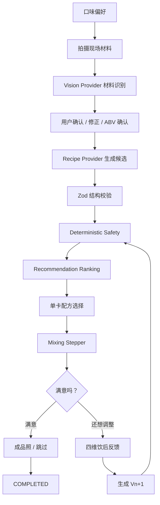
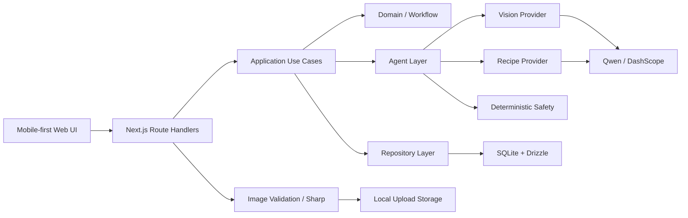

# 黔调 QIANDIAO

> **贵州白酒年轻化调饮 Agent**  
> **贵州酒 × 贵州味 × AI**

黔调 QIANDIAO 是一款面向贵州白酒年轻化消费场景的 AI 调饮 Agent。项目立足贵州本地酒产业与特色农产品资源，因地制宜地将贵州白酒与刺梨等具有鲜明地域特色的风味材料融入 AI 调饮流程，探索更年轻、更个性化、更具贵州地域辨识度的白酒消费体验。

用户可以选择甜度、酸度、酒感、浓郁度等口味偏好，并拍摄现场已有的白酒、饮料及调饮材料。系统识别并确认可用原料后，会生成个性化调饮方案，完成结构校验与安全裁决，再通过分步骤交互指导用户完成实际调制。试饮后，用户还可以继续反馈，生成 V2 / V3 / … 的下一版配方。

**黔调不是生成一张固定配方，而是让材料、口味、实际调制与饮后反馈形成持续闭环。**

---

## Demo 说明

**本项目采用本地局域网部署方式进行现场 Demo，暂不提供公网访问 URL。**

运行项目后，手机与运行设备连接至同一 Wi-Fi 或手机热点，即可通过运行设备的局域网 IPv4 地址访问完整移动端 Demo：

```text
手机浏览器
    │
    │ 同一局域网
    ▼
http://<运行设备 IPv4>:3000
    │
    ▼
黔调 QIANDIAO
```

例如：

```text
http://192.168.137.1:3000
```

当前 Demo 采用 **Local-first Architecture**：Next.js、SQLite、本地图片存储运行在同一台演示设备上，手机只负责浏览器交互与拍摄。该方案用于保证现场拍照、图片处理、会话持久化与模型调用能够稳定联动，并不代表已经开放公网多用户部署。

---

## 为什么是「黔调」

贵州拥有鲜明的白酒产业基础，也拥有刺梨等具有地方辨识度的特色农产品。

如果只是把这些材料写进一张固定配方，它仍然只是另一份调酒菜单。黔调尝试解决的是：**如何让贵州本地的酒、本地的味道，以及用户现场真实拥有的材料，动态进入同一个 AI 调饮过程。**

因此，黔调的地域特色不是简单给通用调酒产品套一层“贵州皮肤”，而是把贵州白酒和当地特色材料真正放进感知、确认、生成、推荐、安全裁决和反馈调整链路中。

---

## 核心体验

| 阶段 | 用户操作 | 系统能力 |
| --- | --- | --- |
| 口味偏好 | 选择甜度、酸度、酒感、浓郁度 | 建立本次 Taste Profile |
| 拍摄材料 | 拍摄桌面已有白酒、饮料及调饮材料 | Vision Provider 识别材料、类别、品牌、置信度及可能的 ABV |
| 人工确认 | 修正识别结果，确认酒类信息 | 确保进入配方的材料真实可用 |
| 生成方案 | 请求 AI 推荐 | 一次生成 A / B / C 三套候选，进行校验、安全裁决与推荐排序 |
| 配方选择 | 接受、跳过或换一批 | 单卡浏览推荐候选，三张均不喜欢后可主动重新生成 |
| 分步调制 | 按步骤完成真实调饮 | Mixing Stepper 持久化当前步骤，刷新后可恢复 |
| 饮后反馈 | 选择“满意”或“还想调整” | 根据反馈生成 V2 / V3 / … 下一版本 |
| 完成 | 可拍摄成品照，也可跳过 | 保存会话状态并完成 Session |

---

## Agent 工作流



完整流程形成：

**感知 → 确认 → 生成 → 校验 → 推荐 → 执行 → 反馈 → 再生成**

---

## 三种配方策略

每次初始生成或换一批，后台都会产生恰好三套差异化候选：

- **A · Conservative**：优先使用已经确认的现场材料，以较稳定的比例和较低尝试门槛为主。
- **B · Creative**：仍以现场材料为主，通过比例、温度、加入顺序和调制方式制造更明显的体验差异。
- **C · Upgrade**：允许在受控范围内补充少量常见调饮材料，为当前桌面条件提供更开放的升级方向。

三套方案不会简单按照固定 A → B → C 顺序展示。系统会进行 Recommendation Ranking，并优先展示更匹配当前偏好与材料条件的方案。

---

## Safety

黔调不会直接把大模型输出中的 `safetyLevel` 当作最终安全结论。

模型负责提出方案，最终由确定性 Safety Engine 再次裁决。当前规则链包括：

- 酒精度与最终 ABV 估算
- 酒类 ABV 未确认保护
- 能量饮料相关规则
- 非食品材料检测
- 过敏原风险提示
- 实验性材料规则
- `ALLOW / WARN / BLOCK` 三级裁决

`BLOCK` 候选不会直接进入用户可选列表。

> **模型负责创造，规则负责守边界。**

---

## 饮后反馈与版本链

用户选中第一杯后，流程不会结束。

调制完成后，系统首先询问“满意吗？”。如果用户还想调整，可以针对：

- 甜度
- 酸度
- 酒感
- 浓郁度

提交相对反馈。

系统随后基于当前已接受配方 `Vn`、本轮反馈、已确认材料与调整约束生成一个新的 `Vn+1`。

```text
V1
 ↓ 太甜、酒感偏强
V2
 ↓ 希望更清爽
V3
 ↓ 满意
COMPLETED
```

因此，黔调的个性化并不是一次 Prompt，而是会话内部持续发生的配方—试饮—反馈—调整闭环。

---

## AI Provider 与降级机制

项目支持两种运行模式：

### `AI_MODE=qwen`

真实 AI 模式：

- Vision Provider：读取用户上传图片并识别现场材料
- Recipe Provider：根据偏好和材料生成三套结构化候选
- Adjustment：根据饮后反馈生成下一版本配方

模型输出会经过 JSON / Schema Validation；当输出异常时，会进行 Repair，仍失败或超时则自动降级至 Fallback Provider。

### `AI_MODE=fallback`

确定性本地演示模式，无需模型 API Key，即可运行主要产品流程，适合开发、自动化测试与网络不稳定环境下的 Demo。

> 注意：Fallback Vision 使用预设的确定性识别结果，仅用于流程演示，并不等同于真实 AI 图像识别。

---

## Architecture



主要目录：

```text
app/                       Next.js App Router 与 HTTP API
components/                按产品流程拆分的前端组件
src/
├── agent/                  Prompt、候选校验、推荐排序、调整约束
├── application/            Session 与业务 Use Case
├── config/                 环境变量与运行配置
├── domain/                 Recipe / Ingredient / Feedback 等领域模型
├── infrastructure/         数据库、上传、Qwen/Fallback Provider
├── providers/              Provider 接口
├── repositories/           Repository 抽象
├── safety/                 ABV 与确定性 Safety Rules
└── workflow/               Session 状态机

drizzle/                    SQLite migrations
scripts/                    数据库 migrate / seed
tests/                      Unit / Integration / Contract / Component / E2E
```

---

## Local Demo

### 环境要求

- Node.js `24.x`
- pnpm `11.x`
- Windows / macOS / Linux
- 手机与电脑处于同一局域网

### 1. Clone

```bash
git clone https://github.com/Chan10years/QianDiao.git
cd QianDiao
```

### 2. 安装依赖

```bash
corepack enable
pnpm install --frozen-lockfile
```

如果 Windows 因权限问题无法执行 `corepack enable`，可直接使用：

```bash
corepack pnpm install --frozen-lockfile
```

### 3. 配置环境

复制 `.env.example` 为 `.env.local`。

macOS / Linux：

```bash
cp .env.example .env.local
```

Windows 可以手动复制并重命名。

无需模型 API 时保持：

```env
AI_MODE=fallback
```

### 4. 初始化数据库

```bash
pnpm db:migrate
pnpm db:seed
```

### 5. 构建并启动现场 Demo

```bash
pnpm build
pnpm start --hostname 0.0.0.0 --port 3000
```

开发模式可使用：

```bash
pnpm dev --hostname 0.0.0.0
```

### 6. 手机访问

Windows：

```powershell
ipconfig
```

找到当前 Wi-Fi 或手机热点适配器的 IPv4 地址，例如：

```text
192.168.137.1
```

保证手机和电脑连接到同一网络，然后在手机浏览器访问：

```text
http://192.168.137.1:3000
```

> `127.0.0.1` / `localhost` 只能由运行服务的电脑自己访问；手机必须使用运行设备的局域网 IPv4 地址。

详细运行、局域网联调与故障恢复方式见 [`PRODUCTION.md`](./PRODUCTION.md)。

---

## 启用 Qwen

在 `.env.local` 中配置非敏感参数：

```env
AI_MODE=qwen
QWEN_BASE_URL=https://dashscope.aliyuncs.com/compatible-mode/v1
QWEN_RECIPE_MODEL=<your-recipe-model>
QWEN_VISION_MODEL=<your-vision-model>
```

真实 `DASHSCOPE_API_KEY` 建议通过系统环境变量提供，**不要提交进 Git 仓库**。

macOS / Linux：

```bash
export DASHSCOPE_API_KEY="your-key"
```

PowerShell：

```powershell
$env:DASHSCOPE_API_KEY="your-key"
```

---

## Demo Walkthrough

现场推荐按照以下顺序体验：

1. 点击「开始调饮」
2. 设置甜度、酸度、酒感、浓郁度
3. 拍摄桌面上的白酒与调饮材料
4. AI 识别材料
5. 人工确认材料及酒精度
6. 生成三套个性化调饮方案
7. 浏览推荐卡片并选择一杯
8. 按 Mixing Stepper 完成实际调制
9. 试饮后选择「满意」或「还想调整」
10. 如继续调整，AI 根据反馈生成 V2 / V3 / … 配方
11. 满意后完成本次调饮 Session

---

## Reliability

项目当前实现了：

- `requestId` 幂等处理
- `expectedVersion` 乐观并发控制
- Session 状态机合法迁移校验
- Provider Timeout / Repair / Fallback
- Recipe / Safety 决策持久化
- Mixing Step 刷新恢复
- 图片上传大小与格式约束
- 服务端图片标准化
- `/api/health` 健康检查

这些机制用于避免移动端网络波动、重复点击、响应丢失或模型输出异常破坏当前调饮 Session。

---

## Tech Stack

| Layer | Technology |
| --- | --- |
| Framework | Next.js 16 |
| Frontend | React 19 + TypeScript |
| Styling | Tailwind CSS 4 |
| AI | Qwen / DashScope Compatible API |
| Validation | Zod 4 |
| Database | SQLite + better-sqlite3 |
| ORM | Drizzle ORM |
| Image Processing | Sharp |
| Unit / Integration | Vitest |
| E2E | Playwright |
| Package Manager | pnpm 11 |
| Runtime | Node.js 24 |

---

## Verification

仓库提供以下检查命令：

```bash
pnpm typecheck
pnpm lint
pnpm test
pnpm test:e2e
pnpm build
```

测试覆盖 Unit、Integration、Contract、React Component 与 Playwright E2E。E2E 场景包括完整调饮旅程、三张拒绝后换批、Mixing 刷新恢复、版本冲突恢复、V2 调整以及响应丢失后的幂等重试等流程。

---

## Current Scope

当前版本定位为 **Hackathon / MVP Local-first Mobile Demo**。

已完成的核心闭环：

```text
真实手机交互
+ AI 材料识别
+ 个性化配方生成
+ Deterministic Safety
+ 分步真实调饮
+ 饮后反馈调整
+ 可恢复 Session
```

当前暂未开放：

- 公网访问实例
- 多用户账户体系
- 多租户部署
- 多实例共享数据库
- 云对象存储与自动云备份

这些属于后续产品化方向，而不是当前现场 Demo 的前提。

---

## Responsible Use

黔调提供的是调饮创意与交互体验，不构成医疗或健康建议。涉及酒精饮品时，请遵守所在地法律法规，并理性饮酒。
