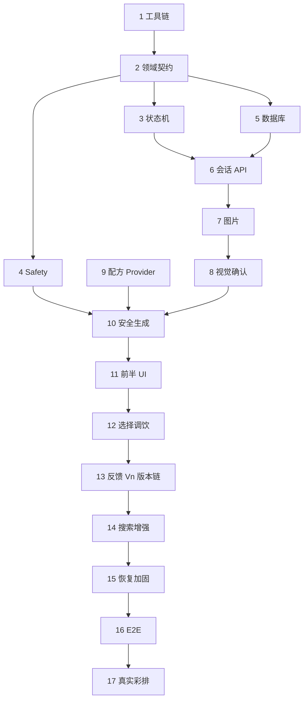

# 白酒创意调饮 Agent MVP Implementation Plan

> **For agentic workers:** REQUIRED SUB-SKILL: Use `superpowers:executing-plans` to implement this plan task-by-task. Use `superpowers:test-driven-development` for every behavior change and `superpowers:verification-before-completion` before any completion claim.

**Goal:** 从空仓库实现一个手机经局域网访问、具备视觉确认、三方案生成、确定性安全裁决、分步调饮、反馈调整和结构化实验记忆的本地 MVP。

**Architecture:** 一个 Next.js 模块化单体承载移动端 UI 与 Route Handlers。应用层编排工作流、Agent、Safety、Repository 和 Provider 接口；SQLite/Drizzle、文件上传与模型 SDK 只存在于 infrastructure。所有外部输入经 Zod，所有候选经确定性 Safety；模型和搜索失败时走本地 fallback。

**Tech Stack:** Node.js 24 LTS、pnpm、Next.js 16 App Router、React 19、TypeScript strict、Tailwind CSS 4、Zod 4、SQLite、Drizzle ORM/Kit、better-sqlite3、sharp、Vitest 4、React Testing Library、Playwright、ESLint、Prettier。

**Spec:** `docs/superpowers/specs/2026-08-21-qiandiao-architecture-design.md`

## Global Constraints

- 开始每个任务前读根目录 `AGENTS.md`，涉及运行/数据时读 `PRODUCTION.md`。
- 严格按任务顺序执行；一个任务通过并更新本文件后再进入下一个。
- 所有功能遵循 Red → Green → Refactor：先写失败测试、亲眼确认目标失败，再写最小实现。
- 不改变已冻结技术栈；新增依赖、端点、表或产品状态前先停下确认。
- 不实现硬件、登录、云部署、RAG、向量数据库、小红书爬虫或微服务。
- `BLOCK` 无绕过路径。任何模型候选在变成可选择方案前必须通过确定性 Safety。
- 每个针对既有会话的变更 API 同时实现 `requestId` 幂等和 `expectedVersion` 乐观并发；创建会话只要求 `requestId` 幂等。
- 每个任务最后只提交本任务文件；不要夹带无关格式化或重构。

---

## 0. 计划使用方式

### 执行规则

- `[ ]` 表示未完成；只有相关验证命令真实通过后才能改成 `[x]`。
- 如果路径、依赖或接口必须偏离计划，先在 Decision Log 记录“原因、选择、后果”，再修改本文。
- 每完成一个 Task，在 Progress Log 写日期、提交 SHA、验证结果和遗留风险。
- 若没有 Git 仓库，Task 1 初始化；之后按任务列出的提交信息提交。
- 遇到非本任务测试失败，先判断是否是已有失败；不得通过跳过或删除测试继续。

### 里程碑

| 里程碑                  | 任务  | 可演示结果                                            |
| ----------------------- | ----- | ----------------------------------------------------- |
| M1 灰盒闭环             | 1–6   | 无 AI、无图片也能建会话、填口味、走状态、安全和数据库 |
| M2 识别与三方案         | 7–10  | 上传/确认材料，fallback 生成三套安全方案              |
| M3 手机完整体验         | 11–13 | 手机完成选择、调饮、反馈、持续调整或完成              |
| M4 真实 Provider 与加固 | 14–17 | 真实模型可切换、搜索可降级、断线可恢复、三次稳定彩排  |

---

## Task 1: 初始化仓库、工具链与标准脚本

**Files:**

- Preserve: `AGENTS.md`, `PRODUCTION.md`, `Task.md`, `docs/superpowers/specs/2026-08-21-qiandiao-architecture-design.md`
- Create: `package.json`, `pnpm-lock.yaml`, `next.config.ts`, `tsconfig.json`, `eslint.config.mjs`, `.prettierrc.json`, `.prettierignore`, `.gitignore`, `.nvmrc`, `.node-version`, `.env.example`
- Create: `app/layout.tsx`, `app/page.tsx`, `app/globals.css`, `app/api/health/route.ts`
- Create: `vitest.config.ts`, `vitest.setup.ts`, `playwright.config.ts`
- Create: `src/config/env.ts`, `src/infrastructure/health/get-health.ts`
- Test: `tests/unit/config/env.test.ts`, `tests/unit/infrastructure/health/get-health.test.ts`

**Required package scripts:**

```json
{
  "dev": "next dev",
  "build": "next build",
  "start": "next start",
  "lint": "eslint .",
  "format": "prettier --write .",
  "format:check": "prettier --check .",
  "typecheck": "tsc --noEmit",
  "test": "vitest run",
  "test:watch": "vitest",
  "test:e2e": "playwright test",
  "db:generate": "drizzle-kit generate",
  "db:migrate": "tsx scripts/db-migrate.ts",
  "db:seed": "tsx scripts/db-seed.ts"
}
```

**Steps:**

- [x] 确认 Node 24 与 Corepack；若不是 Git 仓库，执行 `git init`。
- [x] 在独立临时子目录运行以下命令，只把新脚手架文件合并到根目录，不覆盖四份文档；删除的只能是刚创建并核对过的临时目录：

```bash
pnpm dlx create-next-app@16 scaffold-tmp \
  --ts --tailwind --eslint --app --no-src-dir \
  --import-alias "@/*" --use-pnpm --turbopack
```

- [x] 安装冻结依赖：`zod drizzle-orm better-sqlite3 sharp openai`；开发依赖：`drizzle-kit @types/better-sqlite3 tsx vitest @vitest/coverage-v8 jsdom @testing-library/react @testing-library/jest-dom @testing-library/user-event @playwright/test prettier prettier-plugin-tailwindcss`。
- [x] 运行 `pnpm exec playwright install chromium` 安装 E2E 浏览器；CI/新机器也必须显式执行，不能依赖开发机缓存。
- [x] 在 `package.json` 固定 `packageManager` 和 Node engines；在 `.nvmrc`、`.node-version` 写 `24`。
- [x] 在 `.gitignore` 加入 `.env*`（保留 `.env.example`）、`data/`、Playwright/Vitest 产物。
- [x] 先创建 `env.test.ts`，断言缺少必需变量时解析失败、`AI_MODE=fallback` 不要求密钥、`AI_MODE=qwen` 要求密钥；运行 `pnpm vitest run tests/unit/config/env.test.ts`，确认因模块不存在而失败。
- [x] 实现 `src/config/env.ts` 的 Zod discriminated union，不输出变量值；重跑测试至通过。
- [x] 先写 health 单测，断言仅返回 `status/checks/version`，且响应 JSON 不含 `DATABASE_PATH` 或 `DASHSCOPE_API_KEY`；确认失败。
- [x] 实现纯函数 `getHealthSnapshot(dependencies)` 和薄 Route Handler；Provider 健康只报告模式，不做付费调用。
- [x] 创建最小移动端首页，主按钮创建会话的行为留到 Task 6；当前只说明项目状态。
- [x] 运行：

```bash
pnpm lint
pnpm format:check
pnpm typecheck
pnpm test
pnpm build
```

**Acceptance:** 五个命令全绿；`GET /api/health` 不泄露秘密；锁文件存在；四份文档未被脚手架覆盖。

**Commit:** `chore: initialize nextjs toolchain and health contract`

---

## Task 2: 定义领域 Schema 与共享错误契约

**Files:**

- Create: `src/domain/preferences.ts`
- Create: `src/domain/session.ts`
- Create: `src/domain/ingredient.ts`
- Create: `src/domain/recipe.ts`
- Create: `src/domain/feedback.ts`
- Create: `src/domain/safety.ts`
- Create: `src/domain/api.ts`
- Create: `src/domain/id.ts`
- Test: `tests/unit/domain/*.test.ts`
- Test fixtures: `tests/fixtures/domain.ts`

**Public contracts:**

```ts
type TasteLevel = 1 | 2 | 3 | 4 | 5;

interface TasteProfile {
  sweetness: TasteLevel;
  acidity: TasteLevel;
  alcoholIntensity: TasteLevel;
  body: TasteLevel;
}

type SessionState =
  | "PREFERENCES"
  | "SCAN"
  | "CONFIRM"
  | "READY"
  | "RECIPE_SELECTION"
  | "MIXING"
  | "FEEDBACK"
  | "ADJUSTMENT"
  | "COMPLETED";

type IngredientCategory =
  | "spirit"
  | "mixer"
  | "tea"
  | "fruit"
  | "sweetener"
  | "herb"
  | "ice"
  | "energy_drink"
  | "medicine"
  | "non_food"
  | "unknown";

type RecipeStrategy = "A_CONSERVATIVE" | "B_CREATIVE" | "C_UPGRADE";
type SafetyLevel = "ALLOW" | "WARN" | "BLOCK";
type FeedbackDelta = -2 | -1 | 0 | 1 | 2;
```

**Steps:**

- [x] 为每个 Schema 先写合法最小样本和至少两个错误样本；确认因模块不存在而失败。
- [x] 实现 `TasteProfileSchema`，所有字段必须是 `1..5` 整数；禁止 Zod 静默强制字符串转数字。
- [x] 实现不可预测 ID 的品牌类型与解析：`SessionId`, `RequestId`, `RecipeId`。生成使用 `crypto.randomUUID()`，边界只接收 UUID。
- [x] 实现 `DetectedIngredientSchema`：保留 `rawName` 与 `canonicalName`，酒类必须允许 `abv: null`，但 `confirmed` 独立表示人工确认。
- [x] 实现 `RecipeCandidateSchema`：材料用量、步骤、预计 ABV、差异说明、安全状态、实验性标记、最多 2 个缺失材料。
- [x] 实现 `RecipeCandidateSetSchema`，用 `superRefine` 强制恰好 A/B/C 各一套且 ID 不重复。
- [x] 实现 `FeedbackSchema`：评分 `1..5`、accepted、四个 delta、notes 长度限制、finalImageId 可选。
- [x] 实现 `SuccessEnvelopeSchema` 和 `ErrorEnvelopeSchema`；错误码是稳定英文枚举，message 可本地化。
- [x] 用 `tests/fixtures/domain.ts` 提供唯一合法 fixture 工厂，禁止不同测试各造一套漂移数据。
- [x] 运行 `pnpm vitest run tests/unit/domain && pnpm typecheck`。

**Acceptance:** 所有外部数据类型都有运行时 Schema；错误 JSON 会被拒绝；业务代码不需要 `any`。

**Commit:** `feat: define validated domain contracts`

---

## Task 3: 实现会话状态机

**Files:**

- Create: `src/workflow/session-machine.ts`
- Test: `tests/unit/workflow/session-machine.test.ts`

**Public contract:**

```ts
interface TransitionContext {
  hasPreferences: boolean;
  hasOverviewImage: boolean;
  allIngredientsConfirmed: boolean;
  alcoholAbvConfirmed: boolean;
  hasRecipeSet: boolean;
  hasSelectedRecipe: boolean;
  currentStep: number | null;
  totalSteps: number | null;
  hasFeedback: boolean;
}

function transition(
  from: SessionState,
  event: SessionEvent,
  context: TransitionContext,
): SessionState;
```

**Steps:**

- [x] 表驱动测试所有规格中的合法转移。
- [x] 为非法跳转写测试：`PREFERENCES → MIXING`、未确认材料进入 READY、ABV 未确认进入生成、未选配方进入 MIXING。
- [x] 运行测试，确认失败原因是 `transition` 不存在。
- [x] 实现显式转移表与 Guard；非法转移抛出稳定 `INVALID_TRANSITION`，错误包含 from/event，不包含敏感数据。
- [x] 测试 `MIXING` 当前步骤的前进/后退边界，第一步不能再退，最后一步完成后才进入 FEEDBACK。
- [x] 测试 `ADJUSTMENT → MIXING` 只在已选当前反馈生成的下一版本时允许，或 `ADJUSTMENT → COMPLETED` 结束；不绑定具体版本号。
- [x] 运行 `pnpm vitest run tests/unit/workflow/session-machine.test.ts && pnpm typecheck`。

**Acceptance:** 每个状态和事件均有测试；不存在页面自行拼字符串推进状态的需要。

**Commit:** `feat: add guarded session state machine`

---

## Task 4: 实现确定性 Safety 引擎

**Files:**

- Create: `src/safety/types.ts`
- Create: `src/safety/rules/catalog.ts`
- Create: `src/safety/rules/alcohol-energy.ts`
- Create: `src/safety/rules/non-food.ts`
- Create: `src/safety/rules/unknown-abv.ts`
- Create: `src/safety/rules/allergen.ts`
- Create: `src/safety/rules/experimental.ts`
- Create: `src/safety/calculate-alcohol.ts`
- Create: `src/safety/evaluate-safety.ts`
- Test: `tests/unit/safety/*.test.ts`

**Public contract:**

```ts
interface SafetyDecision {
  level: "ALLOW" | "WARN" | "BLOCK";
  estimatedFinalAbv: number | null;
  pureAlcoholMl: number | null;
  hits: Array<{
    ruleId: string;
    ruleVersion: number;
    level: SafetyLevel;
    reason: string;
    alternative?: string;
  }>;
}

function evaluateSafety(input: SafetyInput): SafetyDecision;
```

**Steps:**

- [x] 先为酒精计算写表驱动测试：`pureAlcoholMl = volumeMl * abv / 100`；`finalAbv = totalPureAlcoholMl / totalDrinkMl * 100`；空杯、负数、未知 ABV 拒绝或返回不可计算。
- [x] 写规则测试并确认失败：酒精 + 能量饮料 `BLOCK`；药物/非食品/未知化学品 `BLOCK`；酒类 ABV 未确认 `BLOCK`；过敏原 `WARN`；奇怪但无证据组合 `WARN + experimental`；普通已知组合 `ALLOW`。
- [x] 实现 `SafetyRule` 版本字段和静态 catalog；每条规则包含可读原因、替代方案和证据引用。
- [x] 实现最严重级别聚合顺序 `BLOCK > WARN > ALLOW`，命中列表保持稳定排序。
- [x] 实现纯函数酒精计算；用十进制容差测试，禁止把估算值显示成医学保证。
- [x] 加回归测试：模型候选自带 `ALLOW` 时仍重新计算；传入 `safetyLevel` 不影响引擎结论。
- [x] 加规则完整性测试：ruleId 唯一、版本为正整数、BLOCK 必须有 alternative、evidence 非空。
- [x] 运行 `pnpm vitest run tests/unit/safety && pnpm typecheck`。

**Acceptance:** Safety 无 Provider/Next/数据库依赖；`BLOCK` 无 override 参数；规则变更可追溯。

**Commit:** `feat: implement deterministic safety engine`

---

## Task 5: 建立 Drizzle Schema、迁移与 Repository

**Files:**

- Create: `drizzle.config.ts`
- Create: `src/infrastructure/db/schema.ts`
- Create: `src/infrastructure/db/client.ts`
- Create: `src/infrastructure/db/transaction.ts`
- Create: `src/repositories/session-repository.ts`
- Create: `src/repositories/recipe-repository.ts`
- Create: `src/repositories/feedback-repository.ts`
- Create: `src/infrastructure/repositories/drizzle-*.ts`
- Create: `scripts/db-migrate.ts`, `scripts/db-seed.ts`
- Generate: `drizzle/` migration files
- Test: `tests/integration/repositories/*.test.ts`
- Test helper: `tests/helpers/test-database.ts`

**Required tables:** `sessions`, `images`, `ingredients`, `recipe_sets`, `recipes`, `safety_decisions`, `feedback`, `decision_events`, `experiment_memories`, `idempotency_records`。

**Steps:**

- [x] 先写 repository contract tests，使用每个测试独立临时 SQLite；确认因实现不存在而失败。
- [x] 定义 Drizzle Schema、外键、唯一约束和索引：`idempotency_records(session_id, request_id)` 唯一；recipe version 与 parent 可追踪。
- [x] JSON 字段读写都通过 Task 2 的 Zod Schema，不用 `as SomeType` 硬断言。
- [x] 实现 `withTransaction`，保证配方批次、三配方、安全决策、事件和会话版本原子写入。
- [x] 写失败注入测试：中间 insert 抛错后，所有表和 session version 均不变化。
- [x] 实现 migration 与 seed；seed 只包含 fallback 材料类别、灵感和配方模板。
- [x] 从全新临时目录运行迁移两次，第二次幂等；检查外键开启、busy timeout 和 WAL 配置。
- [x] 运行 `pnpm db:generate`，审阅 SQL，再运行 repository tests。

**Acceptance:** 空 DB 可初始化；事务失败不产生半成品；测试不触碰 `data/app.db`。

**Commit:** `feat: add sqlite schema migrations and repositories`

---

## Task 6: 会话、偏好与幂等 API 纵切

**Files:**

- Create: `src/application/create-session.ts`
- Create: `src/application/get-session.ts`
- Create: `src/application/save-preferences.ts`
- Create: `src/application/idempotency.ts`
- Create: `src/application/unit-of-work.ts`
- Create: `app/api/sessions/route.ts`
- Create: `app/api/sessions/[sessionId]/route.ts`
- Create: `app/api/sessions/[sessionId]/preferences/route.ts`
- Create: `src/infrastructure/http/envelopes.ts`
- Test: `tests/integration/application/session-use-cases.test.ts`
- Test: `tests/integration/api/session-routes.test.ts`

**API examples:**

```json
POST /api/sessions
{"requestId":"<uuid>"}

PUT /api/sessions/<id>/preferences
{
  "requestId":"<uuid>",
  "expectedVersion":0,
  "preferences":{"sweetness":3,"acidity":3,"alcoholIntensity":2,"body":2}
}
```

**Steps:**

- [x] 先写用例测试：创建返回随机 UUID 与 `PREFERENCES/version 0`；保存偏好推进 `SCAN/version 1`。
- [x] 写重复 `requestId` 测试，第二次必须返回相同响应且版本不再增加。
- [x] 写旧 `expectedVersion` 测试，返回领域冲突且不写数据。
- [x] 实现应用用例，不依赖 Request/Response。
- [x] 写 Route 测试：非法 JSON `400`，未知会话 `404`，冲突 `409`，成功信封符合 Task 2。
- [x] 实现薄 Route Handler 和统一错误映射；500 不返回 stack。
- [x] GET 会话返回恢复页面所需的单一快照，不返回数据库路径、Prompt 或密钥。
- [x] 运行会话用例、API 测试和 build。

**Acceptance:** 首个真实纵切完成；幂等、版本和状态在同一事务；M1 后端基础成立。

**Commit:** `feat: add resumable session and preferences api`

---

## Task 7: 安全图片上传与标准化

**Files:**

- Create: `src/providers/image-store.ts`
- Create: `src/infrastructure/uploads/validate-image.ts`
- Create: `src/infrastructure/uploads/normalize-image.ts`
- Create: `src/infrastructure/uploads/local-image-store.ts`
- Create: `src/application/upload-session-image.ts`
- Create: `app/api/sessions/[sessionId]/images/route.ts`
- Test assets: `tests/fixtures/images/valid.jpg`, `valid.png`, `fake.jpg`, `oversized-dimensions.png`
- Test: `tests/unit/uploads/*.test.ts`
- Test: `tests/integration/application/upload-session-image.test.ts`

**Steps:**

- [x] 先写 magic-byte、MIME、扩展名、字节上限、像素上限测试；不能只 mock `file.type`。
- [x] 写路径穿越文件名测试，传入 `../../x.jpg` 后保存键仍必须由服务端 UUID 生成。
- [x] 实现流式/有界读取，先限字节再交给 sharp；捕获解码错误并映射 422。
- [x] 实现 EXIF 方向修正、元数据移除、长边 2048、统一 JPEG；测试输出尺寸和 MIME。
- [x] 实现 `LocalImageStore`，对象键格式 `{sessionId}/{role}-{imageId}.jpg`，绝对路径不出接口。
- [x] 在应用事务中保存图片元数据后再推进相应状态；文件成功而 DB 失败时补偿删除本次新文件。
- [x] Route 接受 multipart/form-data；413、415、422 使用稳定错误码。
- [x] HEIC 暂时返回可操作的兼容提示；不要偷偷加入未验证转换库。
- [x] 运行上传单元、集成测试与 `pnpm build`。

**Acceptance:** 伪造/超大/损坏图被拒绝；正常图标准化；无路径遍历、孤立文件或公开静态路径。

**Commit:** `feat: add bounded image upload pipeline`

---

## Task 8: 视觉 Provider、半开放识别与材料确认

**Files:**

- Create: `src/providers/vision-provider.ts`
- Create: `src/infrastructure/providers/fallback-vision-provider.ts`
- Create: `src/infrastructure/providers/qwen-vision-provider.ts`
- Create: `src/agent/prompts/recognize-ingredients.ts`
- Create: `src/application/recognize-ingredients.ts`
- Create: `src/application/confirm-ingredients.ts`
- Create: `app/api/sessions/[sessionId]/recognition/route.ts`
- Create: `app/api/sessions/[sessionId]/ingredients/route.ts`
- Test: `tests/contract/providers/vision-provider.contract.test.ts`
- Test: `tests/integration/application/recognition.test.ts`

**Provider contract:**

```ts
interface VisionInput {
  overviewImageId: string;
  labelImageIds: string[];
}

interface VisionResult {
  ingredients: DetectedIngredient[];
  needsLabelCloseup: boolean;
  userQuestions: string[];
}
```

**Steps:**

- [x] 写 provider contract test：fallback 与 Qwen adapter 的解析层都必须输出同一 `VisionResultSchema`。
- [x] 写非法模型 JSON、超时、低置信酒类、未知 ABV 测试。
- [x] 实现 fallback provider，返回可编辑的演示识别结果并显式 `sourceMode=fallback`。
- [x] 实现 Qwen adapter：服务端 SDK、超时、结构化 Schema、一次纠错重试；不得把 SDK 类型泄漏到应用层。
- [x] 实现材料规范化：保留 raw name，映射受控 category；无法映射为 `unknown`，不自行杜撰。
- [x] 识别用例从 `SCAN` 进入 `CONFIRM`；Provider 失败保留图片且不破坏会话。
- [x] 确认用例验证所有材料 `confirmed=true`，酒类 ABV 已确认后才进入 `READY`。
- [x] 测试用户增加、删除、改名和纠正 ABV；审计事件只保存摘要。
- [x] 运行 provider contract 与应用集成测试。

**Acceptance:** “模型负责猜、用户负责确认、规则决定能否使用”在代码边界中成立。

**Commit:** `feat: add confirmable ingredient recognition`

---

## Task 9: 初次三策略与单配方调整 Recipe Provider

**Files:**

- Create: `src/providers/recipe-provider.ts`
- Create: `src/infrastructure/providers/fallback-recipe-provider.ts`
- Create: `src/infrastructure/providers/qwen-recipe-provider.ts`
- Create: `src/agent/prompts/generate-recipes.ts`
- Create: `src/agent/validate-candidate-set.ts`
- Create: `src/agent/rank-recommendation.ts`
- Create: `src/agent/fallback/catalog.ts`
- Test: `tests/contract/providers/recipe-provider.contract.test.ts`
- Test: `tests/unit/agent/validate-candidate-set.test.ts`
- Test: `tests/unit/agent/rank-recommendation.test.ts`

**Provider contract:**

```ts
interface RecipeProvider {
  generate(input: RecipeGenerationInput): Promise<RecipeCandidateSet>;
  adjust(input: RecipeAdjustmentInput): Promise<RecipeCandidate>;
}
```

**Steps:**

- [x] 写 contract tests：`generate()` 必须恰好返回 A/B/C；`adjust()` 必须只返回一个 `RecipeCandidate`，以当前配方和本次反馈为输入，不包装成三套；C 缺失材料最多 2 个且来自允许列表。
- [x] 写重复度测试：相同材料、相同步骤、只有无意义 1 ml 差异判为重复；比例变化引发可解释体验差异时允许。
- [x] 实现 deterministic fallback catalog，至少覆盖白酒 + 水/冰、汽水、茶、果汁等常见组合；所有用量可由 Safety 计算。
- [x] 实现推荐排序纯函数：口味距离、安全级别、缺失材料数、实验性构成透明分数；输出外显 `fitReason`。
- [x] 实现 Qwen recipe adapter 和 Prompt：`generate()` 要求 JSON Schema、三策略、differenceReason、推荐所需特征；`adjust()` 要求单个下一版本、父配方上下文和反馈响应；一次解析修复重试。
- [x] Provider 输出中的 safety 字段视为提示，最终字段由 Task 4 引擎覆盖。
- [x] 写无真实 API 的 adapter 解析测试，使用静态响应 fixture；真实调用留 Task 17 smoke。
- [x] 运行 agent 与 provider contract tests。

**Acceptance:** 不联网也能初次给出三套有效方案，并能对当前配方给出一个有效下一版本；真实与 fallback Provider 可互换；比例方案不会被误删。

**Commit:** `feat: add three-strategy recipe providers`

---

## Task 10: 生成用例、Safety 修复循环与配方 API

**Files:**

- Create: `src/application/generate-recipe-set.ts`
- Create: `src/application/repair-blocked-recipe.ts`
- Create: `src/application/select-recipe.ts`
- Create: `app/api/sessions/[sessionId]/recipes/route.ts`
- Create: `app/api/sessions/[sessionId]/selection/route.ts`
- Test: `tests/integration/application/generate-recipe-set.test.ts`
- Test: `tests/integration/api/recipe-routes.test.ts`

**Generation algorithm:**

```text
validate → load confirmed input → state guard → safety precheck
→ provider generates 3 → Zod parse → dedupe → Safety each
→ repair BLOCK max 2 → fallback replace → rank → transaction save
```

**Steps:**

- [x] 先写 happy-path 集成测试，断言单事务写入 recipe_set、3 recipes、3 safety_decisions、推荐 ID、decision_event，并进入 `RECIPE_SELECTION`。
- [x] 写 ABV 未确认预检测试：Provider 调用次数必须为 0，返回 422。
- [x] 写一个候选 BLOCK 后修复成功测试；断言安全引擎在修复后再次运行。
- [x] 写连续两次修复仍 BLOCK 测试；断言替换为 fallback，最终可选 3 套均为 ALLOW/WARN。
- [x] 写 Provider 非法 JSON/超时测试：重试一次后 fallback；记录降级，不泄漏响应全文。
- [x] 写事务失败与重复 requestId 测试：无半写、无重复调用副作用。
- [x] 实现应用用例，模型调用在事务外，最终版本检查与落库在短事务内；若期间版本改变则 409。
- [x] 选择用例要求 `WARN` 携带 `warningAcknowledged=true`；`BLOCK` 永远拒绝；成功进入 `MIXING/currentStep=0`。
- [x] 实现薄 API、错误映射和成功信封。
- [x] 运行生成/选择集成测试、Safety 全套和 build。

**Acceptance:** M2 的后端闭环完成；任意 Provider 故障或危险候选都无法绕过 Safety 或破坏三方案合同。

**Commit:** `feat: orchestrate safe recipe generation and selection`

---

## Task 11: 手机 UI 壳、五档偏好与拍照确认

**Files:**

- Create: `app/session/[sessionId]/page.tsx`
- Create: `components/session/session-shell.tsx`
- Create: `components/session/progress-header.tsx`
- Create: `components/session/fixed-action-bar.tsx`
- Create: `components/preferences/taste-slider.tsx`
- Create: `components/preferences/preferences-screen.tsx`
- Create: `components/scan/camera-screen.tsx`
- Create: `components/scan/image-preview.tsx`
- Create: `components/ingredients/ingredient-confirmation-screen.tsx`
- Create: `components/ingredients/ingredient-row.tsx`
- Create: `src/infrastructure/http/session-client.ts`
- Test: `tests/components/preferences/*.test.tsx`
- Test: `tests/components/ingredients/*.test.tsx`

**Steps:**

- [ ] 先写 `TasteSlider` 测试：初始值、键盘方向键、五档整数、两端标签和可访问名称。
- [ ] 实现原生 `input[type=range]`，不安装 slider 库；视觉刻度与值说明不影响键盘可用性。
- [ ] 写偏好提交测试：按钮 loading 时不可重复提交；失败保留输入；成功渲染 SCAN。
- [ ] 实现 `SessionShell` 根据服务端快照切屏，不在客户端复制一套业务状态机。
- [ ] 写拍照测试：`accept="image/jpeg,image/png,image/webp"`、`capture="environment"`，预览可替换，上传阶段明确。
- [ ] 写材料确认测试：用户可增删改；未确认或酒类 ABV 缺失时 CTA 禁用并解释；不得只显示 confidence 百分比不让编辑。
- [ ] 实现 session client，每个 mutation 创建稳定 requestId；重试同一次操作复用 requestId，成功后才生成新的。
- [ ] 手机视口检查固定底部 CTA 不遮挡内容，触控目标至少约 44px，错误提示可被屏幕阅读器感知。
- [ ] 运行组件测试、typecheck 和 build。

**Acceptance:** 用户能在手机上完成偏好、拍照、识别纠错和强制确认；失败不会清空表单。

**Commit:** `feat: build mobile preferences scan and confirmation flow`

**Learning checkpoint（用户手写，不由 Agent 代写）：** 在 `learning/day1-vanilla/` 用 HTML/CSS/JS 复现一个滑杆、表单提交和 `<pre>` 输出；能口述 DOM 事件顺序后再继续。

---

## Task 12: 三卡选择与分步调饮体验

**Files:**

- Create: `components/recipes/recipe-selection-screen.tsx`
- Create: `components/recipes/recipe-card.tsx`
- Create: `components/safety/safety-badge.tsx`
- Create: `components/safety/warning-confirmation.tsx`
- Create: `components/mixing/mixing-screen.tsx`
- Create: `components/mixing/mixing-step.tsx`
- Create: `src/application/advance-mixing.ts`
- Create: `app/api/sessions/[sessionId]/mixing/advance/route.ts`
- Test: `tests/components/recipes/*.test.tsx`
- Test: `tests/components/mixing/*.test.tsx`
- Test: `tests/integration/application/advance-mixing.test.ts`

**Steps:**

- [x] 写三卡测试：固定 A/B/C 顺序、推荐标签、differenceReason、材料/用量/ABV/步骤/缺失/安全全部可见。
- [x] 写安全可访问性测试：三张最终卡只能是 ALLOW/WARN；WARN 有图标+文字+原因，必须显式 checkbox/button 确认；被 BLOCK 的原候选只在独立审计提示中保留，不能占用可选卡。
- [x] 实现卡片，不把推荐方案自动选中；用户必须主动确认。
- [x] 写 mixing 用例测试：选择后 step 0；合法前进/后退；越界 409；最后一步完成进入 FEEDBACK。
- [x] 写重复 advance 的 requestId 测试，currentStep 只推进一次。
- [x] 实现一次只显示一步的界面，提供完成、返回、遇到问题；普通步骤不要求拍照。
- [x] 对规格标记的关键节点允许附加照片，但不阻断无照片的普通步骤。
- [x] 中途刷新组件从服务端 `currentStep` 恢复，不使用 localStorage 作为真相源。
- [x] 运行组件、应用集成测试和手机 viewport E2E 子集。

**Acceptance:** 用户可比较并自主选择；Safety 信息清楚；刷新和重复点击不跳步。

**Commit:** `feat: add recipe selection and resumable mixing ui`

---

## Task 13: 成品反馈、单配方 Vn 版本链与实验记忆

**Files:**

- Create: `src/application/save-feedback.ts`
- Create: `src/application/generate-adjustment.ts`
- Create: `src/agent/build-adjustment-constraints.ts`
- Create: `src/application/complete-session.ts`
- Create: `app/api/sessions/[sessionId]/feedback/route.ts`
- Create: `app/api/sessions/[sessionId]/adjustments/route.ts`
- Create: `app/api/sessions/[sessionId]/complete/route.ts`
- Create: `components/feedback/feedback-screen.tsx`
- Create: `components/feedback/delta-control.tsx`
- Create: `components/adjustment/adjustment-screen.tsx`
- Create: `components/completed/completed-screen.tsx`
- Test: `tests/unit/agent/build-adjustment-constraints.test.ts`
- Test: `tests/integration/application/feedback-adjustment.test.ts`
- Test: `tests/components/feedback/*.test.tsx`

**Steps:**

- [ ] 写反馈 Schema/UI 测试：评分 1–5、accepted、四维 `-2..2`、notes 上限、成品图可选。
- [ ] 写 delta 转约束测试，例如酒感 `-2` 必须产生降低纯酒精量或稀释比例的明确约束，不能只改文案。
- [ ] 实现保存反馈用例，进入 `ADJUSTMENT` 或在 accepted 且无调整需求时允许 `COMPLETED`。
- [ ] 写连续版本集成测试：V1 → V2 → V3，每次只返回一个 `RecipeCandidate`，版本号递增，`parentRecipeId` 指向当前配方，`feedbackId` 关联本次反馈；每个版本重新经过 Zod Schema 与确定性 Safety，不重复套用初次三方案合同。
- [ ] 写模型调整失败 fallback 测试；fallback 每次只返回一个下一版本，并用确定性比例规则响应 delta。
- [ ] 实现实验记忆，只保存 `recipeId/feedbackId/summary/tags`；读取记忆只能作为创意上下文，之后仍经过 Safety。
- [ ] 调整页显示当前配方与下一版本的用量和体验变化；用户可接受下一版本继续 MIXING，或满意/不再调整而结束；完成后仍可再次反馈并请求新的下一版本。
- [ ] 完成页展示本次轨迹和安全摘要，不显示隐藏推理。
- [ ] 运行 agent、应用、组件测试和完整 build。

**Acceptance:** 成品反馈形成可解释、可追溯的版本链；记忆不能绕过 Safety；M3 完成。

**Commit:** `feat: close feedback adjustment and memory loop`

---

## Task 14: 可选 SearchProvider 与来源边界

**Files:**

- Create: `src/providers/search-provider.ts`
- Create: `src/infrastructure/providers/disabled-search-provider.ts`
- Create: `src/infrastructure/providers/web-search-provider.ts`
- Create: `src/agent/inspiration/local-library.ts`
- Create: `src/application/find-inspiration.ts`
- Test: `tests/contract/providers/search-provider.contract.test.ts`
- Test: `tests/integration/application/find-inspiration.test.ts`

**Public contract:**

```ts
interface InspirationResult {
  title: string;
  sourceUrl: string;
  sourceName: string;
  summary: string;
  retrievedAt: string;
}
```

**Steps:**

- [ ] 写 contract tests：结果必须有 http(s) URL、来源名、检索时间和短摘要；禁止返回网页全文。
- [ ] 写 disabled、timeout、429、无结果测试，全部回退 `local-library`，且不阻断生成。
- [ ] 实现 2.5 秒默认预算、最多结果数和可替换 adapter。
- [ ] 明确禁止 Playwright/浏览器自动化抓小红书；Provider 只使用合规搜索接口或公开可访问来源。
- [ ] 给 RecipeGenerationInput 只传摘要和 URL；SafetyInput 不接收搜索结论作为规则事实。
- [ ] 记录 `search_used/search_degraded` 决策事件，不记录页面全文。
- [ ] 运行 contract、应用测试和 Safety 回归测试。

**Acceptance:** 搜索是纯增强；关闭、超时或限流时完整闭环行为不变；来源可展示但不假装原创。

**Commit:** `feat: add optional bounded inspiration search`

---

## Task 15: 错误恢复、可观察性与会话恢复加固

**Files:**

- Create: `src/infrastructure/logging/logger.ts`
- Create: `src/infrastructure/http/problem-mapper.ts`
- Create: `src/application/record-decision-event.ts`
- Create: `components/session/error-panel.tsx`
- Create: `components/session/resume-session.tsx`
- Create: `app/error.tsx`, `app/not-found.tsx`
- Test: `tests/unit/infrastructure/logging/logger.test.ts`
- Test: `tests/integration/resilience/idempotency.test.ts`
- Test: `tests/integration/resilience/session-resume.test.ts`

**Steps:**

- [ ] 写日志脱敏测试：输入密钥、Authorization、Cookie、绝对路径、完整 session URL，输出均不得出现原值。
- [ ] 实现结构化 logger：timestamp、level、event、requestId、sessionRef、durationMs、outcome、errorCode、providerMode。
- [ ] 写 API 错误映射矩阵测试：400/404/409/413/415/422/503/500，500 不含 stack。
- [ ] 写断网后同 requestId 重试测试；第一次提交已落库但响应丢失时，第二次返回原响应。
- [ ] 写 GET 快照恢复测试：每一个 SessionState 都能得到足够渲染数据，MIXING 包含 currentStep。
- [ ] 实现 UI 错误面板，明确“重试、手动继续、重新加载”之一；不可只显示“出错了”。
- [ ] 实现 decision events 外显摘要和允许的 metadata 白名单。
- [ ] 运行 resilience、logging、API 与 build。

**Acceptance:** 网络抖动、重复点击、刷新和可预期 Provider 故障均有明确恢复路径；日志可排障且不泄密。

**Commit:** `feat: harden recovery logging and session resume`

---

## Task 16: 完整 Playwright E2E、移动端与可访问性

**Files:**

- Create: `tests/e2e/full-fallback-flow.spec.ts`
- Create: `tests/e2e/safety-block.spec.ts`
- Create: `tests/e2e/resume-and-idempotency.spec.ts`
- Create: `tests/e2e/feedback-iterations.spec.ts`
- Create: `tests/e2e/upload-errors.spec.ts`
- Create: `tests/e2e/helpers/session.ts`
- Modify: `playwright.config.ts`

**Required automated scenarios:**

1. 错认材料后用户修正。
2. 未知 ABV 阻止生成。
3. 酒精 + 能量饮料触发 BLOCK 并被替换。
4. 实验性未知组合 WARN，需确认。
5. 非法模型 JSON 进入 fallback。
6. 重复提交不重复创建。
7. 调饮第 3 步刷新恢复。
8. 连续反馈生成 V1 → V2 → V3；每次调整是独立请求，且新版本关联父配方和本次反馈。
9. 客户端 bundle/响应中无 API key。
10. 无搜索、无真实模型完成全闭环。

**Steps:**

- [ ] 为 E2E 使用独立 `data/test-e2e.db` 与上传目录；每个测试使用唯一会话，不依赖执行顺序。
- [ ] 配置 iPhone 13 和常见 Android viewport；先跑 fallback 完整流并确认失败。
- [ ] 补齐 UI `data-testid` 仅限稳定业务锚点；优先 role/label 查询。
- [ ] 实现上述十个场景，失败时保存 screenshot/trace，但产物不提交。
- [ ] 检查 320px 宽度无横向滚动、固定 CTA 不遮挡、键盘可完成关键流程。
- [ ] 使用自动可访问性检查可作为增强，但不得替代手动检查 label、焦点、颜色外信息和动态错误播报。
- [ ] 连续运行两次 E2E，排除依赖测试顺序和脏数据库的偶然通过。
- [ ] 运行完整发布门禁。

**Acceptance:** 十个场景在两个移动 viewport 通过；测试可重复且不污染真实数据。

**Commit:** `test: cover full mobile agent journey`

---

## Task 17: 真实 Qwen、真实手机与发布冻结

**Files:**

- Create: `tests/smoke/qwen-provider.smoke.ts`
- Create: `scripts/db-backup.ts`
- Modify: `package.json`（增加 `smoke:qwen`、`db:backup`）
- Modify: `PRODUCTION.md`（只记录经过验证的实际差异）
- Modify: `Task.md`（完成记录）

**Steps:**

- [ ] 在受控 `.env.local` 配置真实 Provider；运行前确认密钥不在 shell history、日志或 Git diff。
- [ ] 用可公开测试输入运行一次视觉和配方 smoke；断言响应经同一 Zod Schema，保存耗时/模式，不保存完整响应。
- [ ] 模拟超时、401/403、429、5xx，验证错误分类和 fallback；真实错误不得变成 500 stack。
- [ ] 实现 `db:backup`，使用 better-sqlite3 支持的 backup API 或审阅过的 `VACUUM INTO`，并测试恢复后的数据库完整性。
- [ ] 按 `PRODUCTION.md` 使用真实笔记本、手机和网络跑演示前清单。
- [ ] 连续三次完成：偏好 → 拍照 → 确认 → 初次三方案 → 选择 V1 → 调饮 → 反馈 → 接受 Vn+1 继续调饮，或满意/不再调整完成；至少一次真实流程继续反馈到 V3。
- [ ] 其中一次关闭真实 Provider，证明 fallback 完整可用。
- [ ] 记录 build ID、设备、浏览器、网络、结果、已知风险；只在 `PRODUCTION.md` 写可复现事实。
- [ ] 最终运行：

```bash
pnpm lint
pnpm format:check
pnpm typecheck
pnpm test
pnpm test:e2e
pnpm build
pnpm db:backup --output ./backups/final-smoke.db
```

- [ ] 检查 `git status` 只有预期变更；检查 Git 历史无密钥和用户图片。

**Acceptance:** M4 完成；真实模式与 fallback 模式都可跑；三次真实手机闭环无阻断；备份可恢复；发布门禁全绿。

**Commit:** `chore: verify qwen mobile demo and freeze mvp`

---

## Development Task Dependency Map



说明：图中 T4、T5 可以在人员并行时独立开发，但同一 Agent 执行本计划时仍按编号顺序，减少共享契约漂移。

## Definition of Done

项目只有在以下全部满足时完成：

- [ ] 架构规格第 16 节全部满足。
- [ ] Task 1–17 所有验收项有真实验证证据。
- [ ] `AGENTS.md`、`PRODUCTION.md`、正式规格和实际代码一致。
- [ ] 所有候选在可选择前经过确定性 Safety；BLOCK 无绕过。
- [ ] 真实 Provider 和 fallback 均能完成闭环。
- [ ] 空数据库初始化、备份和恢复已实测。
- [ ] 手机连续三次全流程无阻断问题。
- [ ] 五项自动门禁和 E2E 全绿，无 skip/only。
- [ ] 无密钥、用户图片、真实数据库进入 Git。

## Progress Log

按以下格式追加，不改写历史记录：

```text
YYYY-MM-DD | Task N | commit <sha>
验证：<实际命令与结果>
结果：<完成内容>
风险：<无 / 具体遗留>
```

当前：

- 2026-08-21 | Planning | 未提交
  - 验证：架构六段设计获用户确认；正式规格、协作规则、运行规范与实施计划已起草。
  - 结果：进入 Task 1 前等待文档审阅。
  - 风险：Qwen 视觉模型具体 ID、真实手机 HEIC 支持和 Windows 防火墙行为需在 Task 17 以真实环境验证。

- 2026-08-22 | Task 1 | commit c6ebf64
  - 验证：pnpm install --frozen-lockfile；pnpm format:check；pnpm lint；pnpm typecheck；pnpm test；pnpm build；GET /api/health 返回 HTTP 200 且响应不含配置路径或密钥。
  - 结果：完成 Next.js 16/React 19 工具链、冻结依赖、环境 Schema、健康快照与薄健康路由、最小移动端状态页。
  - 风险：真实 SQLite/图片/Provider、手机演示与数据库迁移留在后续任务；Qwen 和真实手机环境尚未验证。

- 2026-08-23 | Task 2 | commit cd658b1
  - 验证：测试先行；首次可执行领域测试为 7 files、32 tests 中 31 通过，修正格式合法 UUID 负例后为 8 files、35 tests 全部通过；pnpm install --frozen-lockfile；pnpm typecheck；pnpm lint；pnpm format:check；pnpm test（10 files，40 tests）；pnpm build。pnpm test:e2e 未通过，因当前仓库没有 E2E 测试文件（No tests found）。
  - 结果：完成口味、会话状态、材料、三套配方、安全等级、反馈、ID 和 API 成功/错误信封的 Zod 运行时 Schema、品牌 ID 与共享 fixture。
  - 风险：E2E 测试场景、状态机、Safety 引擎和数据库仍未实现，按要求停在 Task 2；真实 Provider、图片与手机环境仍待后续任务验证。

- 2026-08-23 | Task 3 | commit 643f105
  - 验证：独立 Review PASS；pnpm vitest run tests/unit/workflow/session-machine.test.ts（26/26）；pnpm typecheck；pnpm lint；定向 Prettier；集成分支 pnpm lint、pnpm format:check、pnpm typecheck、pnpm test（19 files，106 tests）、pnpm build 均 exit 0。
  - 结果：完成表驱动会话状态机、完整 Guard、MIXING 步骤边界和调整版本选择约束；已合并至集成提交 92ebd70。
  - 风险：Task 6 应用 API 尚未开始；E2E 测试仍未建立。

- 2026-08-23 | Task 4 | commit 416ebc9
  - 验证：独立 Review CONDITIONAL PASS（Task.md 按集成流程延期）；pnpm vitest run tests/unit/safety（27 tests）；pnpm typecheck；pnpm lint；定向 Prettier；集成五项门禁全部 exit 0。
  - 结果：完成确定性 Safety 规则、酒精计算、BLOCK/WARN/experimental 聚合和规则证据 catalog；已合并至集成提交 92ebd70。
  - 风险：真实 Provider 和现实世界安全证据仍待后续任务验证；E2E 测试仍未建立。

- 2026-08-23 | Task 5 | commit 7cb7c56
  - 验证：独立 Review PASS；临时 SQLite 迁移/seed 各执行两次；pnpm vitest run tests/integration/repositories（5 files，13 tests）；pnpm typecheck；pnpm lint；Task 5 精确 Prettier；集成五项门禁全部 exit 0。
  - 结果：完成 Drizzle 13 表 Schema、迁移、事务、Repository、fallback seed、版本默认值和失败回滚测试；已合并至集成提交 92ebd70。
  - 风险：后续应用层 API、上传和 Provider 仍未实现；测试不触碰 data/app.db。
- 2026-08-23 | Task 6 | commits d34ece0, 6cd6f47, b0bfd54
  - 验证：TDD Red 阶段新增跨操作指纹和唯一键竞争测试为 2 项失败；修复后定向应用/API 测试 14/14；pnpm lint；pnpm format:check；pnpm typecheck；pnpm test（21 files，120 tests）；pnpm build；全新临时 SQLite 连续执行两次 pnpm db:migrate（均 exit 0）；Task 5 database/repository 回归 2 files、6 tests；独立 Review 最终 PASS。
  - 结果：完成创建会话、偏好保存、恢复快照、全局 requestId + request_fingerprint 幂等、操作域隔离、VERSION_CONFLICT/IDEMPOTENCY_KEY_REUSED 错误映射；session、偏好、状态、版本和幂等记录在同一事务；Route Handler 保持薄层。
  - 风险：按 Task 6 明确范围未运行 pnpm test:e2e（当前无 E2E 文件）；真实手机、浏览器 E2E、Provider、上传和后续状态流程留在后续任务；既有幂等记录迁移时使用 legacy:<id> 指纹，无法凭历史数据重建原始请求内容，旧记录重试会保守返回幂等键冲突。
- 2026-08-23 | Task 3 状态机版本无关兼容修正
  - 验证：TDD RED 为 27 tests、3 failures（均因旧 V2 字段）；修正后 Task 2 Domain 8 files/35 tests、Task 3 27/27、Task 5 Repository 5 files/13 tests；pnpm lint、pnpm format:check、pnpm typecheck、pnpm test（21 files/121 tests）、pnpm build 均 exit 0。
  - 结果：将 `hasSelectedV2Recipe` 改为 `hasSelectedAdjustedRecipe`，覆盖 V2、再次反馈后的 V3 和未选择本次调整版本的拒绝路径；保留初次 A/B/C Domain 约束。
  - 数据归属：RecipeCandidate 仍只承载候选内容；version/parentRecipeId 由正式 Recipe/Repository 保存；feedbackId 由 Feedback 记录保存并通过 recipeId 指向被反馈配方；直接 `recipes.feedback_id` 关联留在 Task 13 范围。
  - 风险：完整反馈用例、Provider、上传、UI 和 Task 7–10 尚未开始。

- 2026-08-25 | Task 7 | implementation 753c7ab0362fe46e8a2340486b435e6376c2efdf; integration merge 16cefd07671752fda896601310bb9d44edca1249
  - 验证：源分支完整历史含 6028bcb、9d72dff、753c7ab；独立 Review PASS；pnpm install --frozen-lockfile、pnpm lint、pnpm format:check、pnpm typecheck、pnpm test（33 files，179 passed，2 skipped）、pnpm build、git diff --check 均 exit 0；物理路径专项 1 passed、2 skipped，两个 symlink skip 均保留 EPERM 原因，Windows junction 通过。
  - 结果：完成字节/MIME/魔数/解码/像素/EXIF/JPEG 校验、路径边界、requestId/fingerprint/expectedVersion 幂等并发、事务失败补偿删除和 multipart 稳定错误映射；未改共享 Domain。
  - 风险：pnpm test:e2e 未运行（本次 M2 严格命令清单未要求，当前无 E2E 文件）；build 有 Next/Turbopack 动态 UPLOAD_DIR 文件追踪 warning；真实手机和 HEIC 兼容性留后续真实环境验证。

- 2026-08-25 | Task 9 | implementation c3f7b5f2c6a83a938e73940b98b318e277a33b47; integration merge b8a8ccff9330f9669e44594f7f60be93c86b9d6a
  - 验证：源分支完整历史含 d399f56、9acecc3、e7514d9、c3f7b5f；独立 Review PASS；pnpm install --frozen-lockfile、pnpm lint、pnpm format:check、pnpm typecheck、pnpm test（33 files，179 passed，2 skipped）、pnpm build、git diff --check 均 exit 0；未调用真实 Qwen API。
  - 结果：完成 fallback 与 Qwen 可互换 RecipeProvider、generate A/B/C、adjust 单候选、Zod Schema、一次修复重试、timeout/fallback、材料边界和透明推荐排序；`confirmedMaterialNames` 来自已确认材料契约，供后续 Task 8/10 传入并约束 A/B/C。
  - 风险：真实 Qwen API、Task 8 视觉识别和 Task 10 生成/安全修复用例仍未开发或验证；模型 safety 仅作提示，最终裁决仍由 Safety 引擎负责。

- 2026-08-25 | Task 8 | integration verification af733f5be9e8c29fcb124ea249f6a0f3b1a46911; evidence tests 5f75a8b14f9d8bb7a5c2caebb5a8379113bf1d6d
  - 验证：Red 测试提交 f721e2c；独立 Integration Review PASS（Critical 0、Important 0、Minor 0）；pnpm lint、pnpm format:check、pnpm typecheck、pnpm test（41 files，224 passed，2 skipped）、pnpm build、git diff --check 均通过；隔离临时 SQLite 空库迁移两次、自动化 `PRAGMA integrity_check` 严格为 `ok`；定向 lease/迁移测试 6 files、32 passed。
  - 结果：完成 Task 7→8 真实 JPEG 组合链路、Provider 事务外调用、持久化 SQLite session lease、requestId/expectedVersion 原子绑定、过期接管、旧 owner 提交/释放保护，以及识别失败保留图片、幂等 replay、unknown/ABV Guard 和原子状态推进验证；Task 9 Provider 未被 Task 8 修改或提前调用。
  - 风险：未调用真实 Qwen 网络、当前仓库无 E2E 测试、真实手机验证和 Task 10 仍按计划留待后续；build 保留既有 Next/Turbopack `UPLOAD_DIR` 动态追踪 warning。
- 2026-08-26 | Task 10 | implementation 2831de5；review 修复链 e91769c、22bb8b1、14b8332、661de98、df48f78、9cc53ba、c7bd2e1、48afeb3、6923630；integration merge fbb4c1b
  - 验证：Task 10 独立 Review PASS（Critical 0、Important 0、Minor 1）；合并后 pnpm lint、pnpm format:check、pnpm typecheck、pnpm test（43 files，289 passed，2 skipped）、pnpm build、git diff --check 均 exit 0；关键 11 files 定向集成测试 126 passed；隔离临时 SQLite 两次 pnpm db:migrate 均 exit 0，`PRAGMA integrity_check=ok`、`foreign_keys=1`、`journal_mode=wal`、`busy_timeout=5000`。
  - 结果：完成 M2 后端闭环：真实 JPEG 上传/识别/材料确认/ABV Guard/READY、恰好 A/B/C、Zod、Task 4 Safety 最终裁决、BLOCK 修复或 fallback、推荐排序、RECIPE_SELECTION、GET 恢复、选择和 MIXING；Final Integration Review PASS（Critical 0、Important 0、Minor 0）。
  - 风险：pnpm test:e2e 真实结果为 exit 1 `Error: No tests found`，未越界实现 Task 11；build 保留既有 Next/Turbopack `UPLOAD_DIR` 动态追踪 warning；未调用真实 Qwen 网络，真实手机验证留后续任务。Task 11 只允许从本次文档收尾提交后的最终 HEAD 启动。

- 2026-08-26 | Task 11 | implementation 9c8a8b8e5aa31506022e7dcb011bb2b29d3bad53；fixes d86e3e1fe358329bb656642799293802ed458856、2d79fc797d9024b45809537602d200ac5de27d74；integration fast-forward
  - 验证：独立 Reviewer 最终 PASS（Critical 0、Important 0、Minor 1）；Task 11 定向测试 8 files、32 passed；pnpm typecheck、pnpm lint（0 errors、1 个既有 `` warning）、pnpm format:check、pnpm test（50 files、317 passed、2 skipped）、pnpm build（exit 0、1 个既有 `UPLOAD_DIR` tracing warning）、git diff --check 均 exit 0。
  - 结果：完成手机偏好、拍照、识别和材料确认流程；390×844 浏览器验证覆盖偏好 → 拍照 → 识别 → CONFIRM、真实图片预览、CONFIRM 刷新恢复材料、503 精确重试不重复上传、SCAN 同阶段版本冲突重新上传并恢复、CTA 触控高度 48px。
  - 风险：未测试真实 Android/iOS 相机硬件；仓库暂时没有 E2E；Provider 失败场景采用注入/fallback 验证；保留既有 `` 与 `UPLOAD_DIR` warning。

- 2026-08-27 | Task 12 | implementation 41078216e0bb1ee069d318da9c625b0bf483323f；fixes abd48c40162dc95e5a731ad96dfe82b22eafbc26、7fa313ad58366866273059287ad40c035fd7f07d；integration fast-forward to 7fa313ad58366866273059287ad40c035fd7f07d
  - 验证：Reviewer 最终 PASS（Critical 0、Important 0；缓存问题 FIXED）；migration 文件与 journal 顺序完整（0000–0005）；全新临时 SQLite 执行全部 6 条 migration，迁移记录 6 行、外键违规 0；pnpm typecheck、pnpm lint（0 errors、3 warnings）、pnpm format:check、pnpm test（58 files、349 passed、2 skipped）、pnpm build、git diff --check 均 exit 0；pnpm test:e2e 为 exit 1 `Error: No tests found`，仓库暂时没有 E2E，按约定不阻塞。
  - 结果：完成三卡选择与分步调饮；关键路径为拍照优先、允许暂时跳过；照片支持预览、失败重试、替换和刷新恢复；最终修复提交为 `7fa313ad`，完整历史以 fast-forward 集成。
  - Accepted Known Risk：数据库已经提交照片替换后，如果删除旧磁盘文件这一极端操作失败，可能遗留一个无用旧文件。Demo 阶段接受该风险，暂不实现 outbox/reconciliation；不影响当前用户流程和数据库有效照片记录，后续视需要处理。
  - 风险：保留既有 `` lint warnings 与 `UPLOAD_DIR` tracing warning；未实现或开始 Task 13。

- 2026-08-28 | Task 13A/13B 后端基线冻结 | 功能集成提交 `64f45e8f6596f71628a34d52b9fbc7e26d13a482`
  - 结果：Task 13A 数据与版本链底座完成并通过独立审查；Task 13B 后端反馈调整闭环完成并通过独立审查。
  - Review：Reviewer 首轮发现 4 个 Important，已由提交 `64f45e8f6596f71628a34d52b9fbc7e26d13a482` 修复，并通过聚焦复审。
  - 决策：原计划中的旧 Task 13C 已由产品负责人取消/废止，不再实现；不得勾选或宣称旧 13C 已完成。
  - 范围：当前冻结的是可复用的后端基线，不表述为旧版完整 UI 已完成。Swipe、三张拒绝后换一批、Mixing redesign 和新 Final Photo UI 均未在本仓库实现；后续 Product Pivot 将在独立新项目中重新规划。
  - 已知验证缺口：仓库没有可执行 E2E 测试文件；`pnpm test:e2e` 的 `No tests found` 结果按既定规则记录为非阻塞缺口。

## Decision Log

按以下格式追加：

```text
YYYY-MM-DD | 决策标题
背景：
选择：
替代方案：
后果：
```

已冻结决策：

- 2026-08-21 | 模块化单体
  - 背景：单机、本地、短周期 MVP。
  - 选择：一个 Next.js 进程 + SQLite + 本地上传。
  - 替代方案：微服务、独立 Express、云后端。
  - 后果：开发和部署简单；公网与多实例留到后续迁移。

- 2026-08-21 | 双层决策
  - 背景：既要创意，又不能让模型决定安全底线。
  - 选择：Agent 创意层 + 确定性 Safety 最终否决。
  - 替代方案：纯检索、纯 LLM 判断。
  - 后果：规则要维护证据和版本；所有路径都必须调用 Safety。

- 2026-08-21 | 半开放识别
  - 背景：固定白名单太笨，完全开放难以约束。
  - 选择：模型自由识别、受控类别归一、用户强制确认。
  - 替代方案：全白名单、完全自由名称。
  - 后果：数据保留 raw/canonical/category/confidence/confirmed 多个维度。

- 2026-08-21 | 固定三策略
  - 背景：需要稳定展示比较和 Agent 创造性。
  - 选择：A 保守、B 创意、C 最多补 2 种常见材料。
  - 替代方案：动态数量、只给一套。
  - 后果：Provider、校验、UI 和 fallback 都必须恰好三套。

- 2026-08-21 | 结构化实验记忆
  - 背景：需要保存反馈学习，但不需要复杂检索。
  - 选择：recipe/feedback/version/memory 关系表与 JSON 标签。
  - 替代方案：向量数据库/RAG、完全不保存。
  - 后果：可解释、可测试；未来再评估语义检索。

- 2026-08-21 | 搜索仅作灵感
  - 背景：用户希望参考成熟公开方案，同时保留原创性。
  - 选择：可选 SearchProvider + 来源摘要 + 本地降级。
  - 替代方案：Playwright 抓小红书、完全无搜索。
  - 后果：搜索不会阻断流程，也不会成为 Safety 证据入口。

- 2026-08-23 | 幂等记录最小前向扩展
  - 背景：Task 6 创建会话没有既有 sessionId，但现有 idempotency_records 只按 session 内 requestId 唯一，无法保证全局创建幂等。
  - 选择：在现有表增加 request_fingerprint，将 request_id 改为全局唯一，保持 session_id NOT NULL；创建前生成 sessionId，并在同一事务写入 session 与幂等记录。
  - 替代方案：新增独立 session_creation_idempotency 表，或允许 session_id nullable；均未采用。
  - 后果：不增加独立表；历史记录指纹以 legacy:<id> 保守回填，无法重建原始请求内容的旧重试会返回幂等键冲突。

- 2026-08-23 | 初次三套与单配方 Vn 迭代
  - 背景：初次生成需要稳定的 A/B/C 比较体验，但用户反馈应聚焦当前已选配方，而不是再次产生无关候选。
  - 选择：`generate()` 初次固定返回 `RecipeCandidateSet` 的 A/B/C 三套，用户选择一套作为 V1；每次独立调整请求只返回一个当前配方的下一版本 Vn+1，并关联 `parentRecipeId` 与本次 `feedbackId`，重新经过 Schema 和确定性 Safety。
  - 替代方案：调整阶段返回多套候选、把版本链截断在首个下一版本，或在服务端自动无限循环调整；均不采用。
  - 后果：版本链支持 V1 → V2 → V3 → … → Vn；用户接受下一版本后继续 MIXING，满意或不再调整时 COMPLETED；Task 13 必须覆盖连续版本和反馈关联。

- 2026-08-28 | 旧 Task 13C 取消与后端基线冻结
  - 背景：Task 13A/13B 已完成并通过独立审查，产品负责人取消旧 13C，并将后续 Product Pivot 放到独立新项目。
  - 选择：冻结当前可复用后端基线；旧工程不实现旧 13C、Product Pivot、Swipe、三张拒绝后换一批、Mixing redesign 或新 Final Photo UI。
  - 替代方案：继续按旧计划开发 13C 或在旧工程提前实现 Product Pivot；均不采用。
  - 后果：旧工程不得表述为完整 UI 已完成；旧 13C 保持未完成且废止，后续新项目另行规划。
