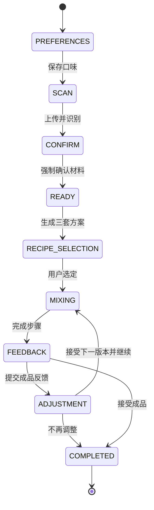
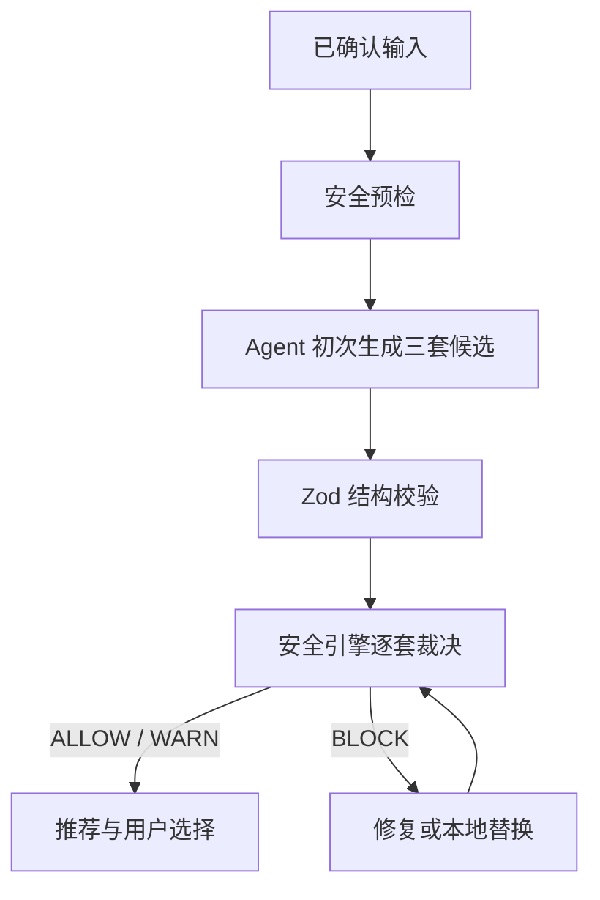
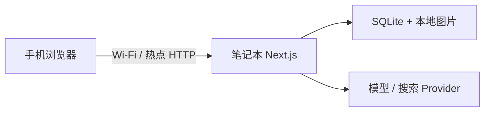

# 白酒创意调饮 Agent：正式架构规格

状态：已批准，进入实现  
日期：2026-08-21  
适用范围：私人学习原型与本地可运行 MVP  
维护规则：产品或架构决策改变时，先更新本文，再更新 `Task.md` 和实现。

## 1. 目标与成功标准

本项目构建一个手机优先的白酒创意调饮 Agent。用户在手机浏览器中填写口味、拍摄桌面材料、确认识别结果；系统在确定性安全层约束下初次生成三套有明确差异的配方，指导用户调制，并根据成品反馈逐次生成当前配方的下一版本。

核心价值不是“调用一次视觉模型”，而是证明下面这个闭环可靠成立：

1. Agent 观察现实材料并显式表达不确定性。
2. 用户纠正识别结果并对关键事实强制确认。
3. 创意决策和安全裁决分层，安全层拥有最终否决权。
4. 用户选择并执行配方，系统保留可恢复的流程状态。
5. 成品反馈形成版本链和结构化实验记忆。

MVP 完成必须同时满足：

- 手机经局域网访问笔记本后端，可跑完整闭环。
- 视觉识别失败时可以手动录入，模型失败时可以走本地保底。
- 初次生成固定返回三套策略不同的有效候选，并标出一套推荐；用户选择其中一套作为 V1。
- 每套候选都经过同一确定性安全引擎；`BLOCK` 不可绕过。
- 刷新、断网重试和重复提交不会破坏流程或重复写入。
- 每次反馈请求只针对当前配方生成一个下一版本 Vn+1；版本可从 V1 持续迭代到 Vn，并可追溯到父配方、本次反馈和命中的安全规则。

## 2. 已冻结范围

### 2.1 包含

- 四个五档绝对口味维度：甜度、酸度、酒感、厚重度。
- 手机拍照上传、压缩和预览。
- 半开放材料识别：模型自由识别，系统归一化到受控类别，用户强制确认。
- 桌面总览图；酒类或低置信结果触发瓶身标签近照。
- 品牌与酒精度由 AI 预填写，用户强制确认。
- 三策略配方、推荐说明、用户选择。
- `ALLOW / WARN / BLOCK` 安全裁决。
- 一次一个步骤的调饮引导和关键节点照片。
- 评分、接受与否、相对口味变化、文字备注、成品照片。
- 配方版本链、决策事件与结构化实验记忆。
- 可选联网搜索，只用于灵感与来源，不参与最终安全裁决。

### 2.2 明确不包含

- 硬件、机械控制、串口或蓝牙协议。
- 连续视频分析、OpenCV 动作识别、实时动作评分。
- 登录、多用户权限、云数据库、云对象存储。
- LangChain 等重型 Agent 框架。
- RAG、向量数据库、语义记忆检索。
- Playwright 抓取小红书或其他网站内容。
- 自动从照片精确估算毫升数。
- 微服务、消息队列、WebSocket。
- 软件给出医疗判断，或把民间“食物相克”当作确定医学事实。

## 3. 核心产品流程



合法状态只有：

```text
PREFERENCES
SCAN
CONFIRM
READY
RECIPE_SELECTION
MIXING
FEEDBACK
ADJUSTMENT
COMPLETED
```

状态推进由应用用例调用状态机完成。页面不能直接改状态，数据库事务失败时不能推进状态。

## 4. 用户输入与确认边界

### 4.1 绝对口味

每个维度用原生 range 控件呈现五档，内部存储整数 `1..5`：

| 维度 | 1 | 3 | 5 |
|---|---|---|---|
| 甜度 | 不甜 | 平衡 | 很甜 |
| 酸度 | 不酸 | 平衡 | 很酸 |
| 酒感 | 柔和 | 中等 | 强烈 |
| 厚重度 | 清爽 | 中等 | 浓郁 |

视觉上标出关键刻度和两端语义，用户可以拖动，但提交值永远落在五档整数上。

### 4.2 相对反馈

成品反馈不重填绝对口味，而使用 `-2..+2` 的相对变化：

- `-2` 明显降低
- `-1` 略微降低
- `0` 保持
- `+1` 略微提高
- `+2` 明显提高

相对变化覆盖甜度、酸度、酒感和厚重度。系统必须解释下一版本如何响应这些变化，并将其关联到当前配方和本次反馈。

### 4.3 图片角色

```ts
type ImageRole = "overview" | "label_closeup" | "final_drink";
```

- `overview`：必需，识别桌面整体材料。
- `label_closeup`：条件必需，酒类品牌、酒精度或结果置信度不足时请求。
- `final_drink`：反馈阶段可选，用于保存实验上下文，不做医学或品质结论。

### 4.4 强制确认

以下事实未经用户确认不得进入配方生成：

- 材料是否实际存在。
- 材料规范名称和类别。
- 酒类品牌或产品名称（如可见）。
- 酒精度 ABV；未知时必须补充，不允许模型猜值继续。
- 用户手动增加、删除或纠正的材料。

## 5. 初次生成的三套配方策略

初次生成必须恰好得到三套可执行、互有实质差异的候选；用户从中选择一套作为 V1：

| 策略 | 约束 | 定位 |
|---|---|---|
| A 保守 | 只使用已确认的桌面材料 | 成功率最高、最低认知负担 |
| B 创意 | 仍以桌面材料为主，通过比例、顺序、温度和手法产生创意 | 展示 Agent 的创造性 |
| C 升级 | 使用桌面材料，最多建议 2 种常见缺失材料 | 给用户一条容易补齐的提升路径 |

C 允许建议的常见材料限定为：冰块、柠檬或青柠、苏打水、可乐或柠檬汽水、茶、果汁、糖浆、蜂蜜、薄荷。新增清单的变更属于产品决策，不能由模型临时扩大。

仅比例不同也可以构成有效候选，但必须：

- 对甜酸平衡、酒感、香气或口感产生可解释的区别。
- 在 `differenceReason` 中写明为什么不是重复方案。
- 通过确定性重复度检查；只有数字微调而体验无差异时应重新生成。

Agent 必须标出一个 `recommendedRecipeId` 并说明适配原因，但界面必须允许用户选择另外两套。

## 6. 双层决策结构

本系统采用“创意决策层 + 确定性安全层”的双层结构。



### 6.1 创意决策层

职责：

- 理解口味偏好和材料上下文。
- 设计初次生成的三种策略配方。
- 解释差异并推荐一套。
- 根据当前配方和本次反馈生成一个下一版本 Vn+1。
- 在启用搜索时总结公开灵感来源。

限制：

- 只能返回结构化候选，不能直接写入最终选定配方。
- 不能覆盖、改写或忽略安全结论。
- 不能输出隐藏思维链；只保存面向用户的简短决策摘要。

### 6.2 确定性安全层

职责：

- 校验酒精度与用量能否计算。
- 估算整杯酒精度和纯酒精量。
- 检查明确禁止的组合、非食品材料、药物、未知化学品和过量风险。
- 对过敏原、不确定证据和实验性组合作出一致裁决。
- 给出规则编号、原因和可行替代。

安全层用纯 TypeScript 和版本化规则实现，不依赖 LLM 的自由判断。

### 6.3 裁决语义

```ts
type SafetyLevel = "ALLOW" | "WARN" | "BLOCK";
```

| 级别 | 含义 | 用户是否可继续 |
|---|---|---|
| ALLOW | 未命中已知风险规则 | 可以 |
| WARN | 有可解释风险或证据不足，需用户明确确认 | 确认后可以 |
| BLOCK | 已知不可接受风险或关键数据缺失 | 不可以 |

硬性边界：

- `BLOCK` 不可被用户、模型或管理员开关绕过。
- 酒精饮料与能量饮料的组合在本产品中采用保守策略，判定为 `BLOCK`。
- 药物、清洁剂、非食品材料、未知化学品判定为 `BLOCK`。
- 涉及酒类但 ABV 未确认时判定为 `BLOCK`，直到补齐信息。
- 已知过敏原默认 `WARN`；若未来引入用户已知严重过敏资料，再升级对应规则。
- “很奇怪但没有可靠安全证据”的食品组合不是 `BLOCK`，应为 `WARN` 并标为实验性。
- “鸡蛋和芹菜不能同吃”一类民间相克说法不得直接成为安全规则；规则需有可审阅证据和版本记录。

### 6.4 规则结构

```ts
interface SafetyRule {
  ruleId: string;
  version: number;
  title: string;
  severity: SafetyLevel;
  conditions: RuleCondition[];
  reason: string;
  evidence: EvidenceRef[];
  alternative?: string;
}
```

源规则存于版本控制中的 TypeScript 文件；每次命中结果存入数据库，包含 `ruleId` 和 `ruleVersion`，保证历史可追溯。

## 7. 系统架构

### 7.1 运行拓扑

第一阶段采用一个进程、一个应用、一个 SQLite 数据库：



这是一套模块化单体，不是微服务。手机负责界面和拍照，笔记本负责页面服务、API、状态机、规则、模型调用和持久化。

### 7.2 代码层次

```text
app/                  页面、布局、Route Handlers
components/           纯展示和交互组件
src/application/      用例编排、事务与幂等
src/domain/           类型、Schema、实体不变量
src/workflow/         状态机和合法转移
src/agent/            生成、推荐、调整的应用逻辑
src/safety/           规则、计算和裁决
src/providers/        Vision/Recipe/Search/Fallback 接口
src/repositories/     持久化接口
src/infrastructure/   SQLite、Drizzle、上传、模型 SDK 实现
tests/                单元、集成、组件、端到端测试
data/                 运行时数据库和上传；不提交 Git
learning/             学习镜像练习；不属于生产实现
```

依赖方向只能是：

```text
UI → API → Application → Domain/Workflow/Agent/Safety → Interfaces → Infrastructure
```

禁止的反向依赖：

- UI 直接访问数据库或模型 SDK。
- Route Handler 内堆积业务规则。
- Safety 依赖具体模型 Provider。
- Domain 依赖 Next.js、Drizzle 或文件系统。
- Provider 自行推进工作流状态。

### 7.3 生成用例

`GenerateRecipeSet` 的固定顺序：

1. Zod 校验请求和 `expectedVersion`。
2. 加载会话、口味和已确认材料。
3. 检查当前状态只能从 `READY` 发起。
4. 运行输入安全预检。
5. 调用 Recipe Provider 初次生成恰好三套候选。
6. Zod 解析结构化响应。
7. 对每套候选运行确定性安全检查和重复度检查。
8. 对 `BLOCK` 候选最多修复两轮；仍失败则用本地模板替换。
9. 对初次生成的三套有效候选进行推荐排序。
10. 在单个事务中保存候选、裁决、决策摘要和会话状态。

模型、解析、搜索或网络错误都不能绕过第 7 步。

## 8. 技术栈冻结

| 范畴 | 选型 |
|---|---|
| 运行时 | Node.js 24 LTS |
| 包管理 | pnpm，提交 `pnpm-lock.yaml` |
| 全栈框架 | Next.js 16 App Router |
| UI | React 19、TypeScript strict、Tailwind CSS 4 |
| 输入输出校验 | Zod 4 |
| 数据库 | SQLite |
| ORM | Drizzle ORM + Drizzle Kit |
| SQLite 驱动 | better-sqlite3 |
| 图片处理 | sharp |
| 单元/集成测试 | Vitest 4 |
| 组件测试 | React Testing Library |
| 端到端测试 | Playwright |
| 代码质量 | ESLint + Prettier + TypeScript |
| 默认模型接入 | 阿里云百炼 OpenAI 兼容接口，先用 `qwen3.7-plus` |

模型名称必须来自环境变量，不写死在领域逻辑中，以便 Provider 无痛替换。

## 9. Provider 契约与降级

```ts
interface VisionProvider {
  recognize(input: VisionInput): Promise<VisionResult>;
}

interface RecipeProvider {
  generate(input: RecipeGenerationInput): Promise<RecipeCandidateSet>;
  adjust(input: RecipeAdjustmentInput): Promise<RecipeCandidate>;
}

interface SearchProvider {
  findInspiration(input: SearchInput): Promise<InspirationResult[]>;
}

interface FallbackRecipeProvider extends RecipeProvider {}
```

规则：

- Provider 返回值一律先经 Zod 解析。
- 真实模型不可用时使用 deterministic fallback；演示仍能完成。
- 搜索是可选增强，超时或失败直接回退本地灵感库。
- 搜索结果只进入 `inspirationSources` 和创意提示，不能新增安全事实。
- 不抓取登录态、反爬页面或未经授权的内容。
- 所有模型密钥只存在服务端环境变量。

## 10. 数据模型

### 10.1 存储布局

```text
data/app.db
data/uploads/{sessionId}/{role}-{imageId}.jpg
```

上传文件使用服务端生成文件名，存于 Web 根目录之外。数据库只存相对对象键，不向客户端泄漏绝对路径。

### 10.2 表

| 表 | 关键字段 | 用途 |
|---|---|---|
| `sessions` | `id`, `state`, `version`, `preferences_json`, `selected_recipe_id`, `current_step` | 会话聚合根与乐观并发 |
| `images` | `id`, `session_id`, `role`, `object_key`, `mime`, `width`, `height` | 照片元数据 |
| `ingredients` | `raw_name`, `canonical_name`, `category`, `brand`, `abv`, `confidence`, `confirmed` | 半开放识别和确认 |
| `recipe_sets` | `id`, `session_id`, `recommended_recipe_id`, `source_mode` | 初次三方案批次 |
| `recipes` | `strategy`, `materials_json`, `steps_json`, `estimated_abv`, `version`, `parent_recipe_id`, `feedback_id` | 配方与版本链；调整版本关联父配方和本次反馈 |
| `safety_decisions` | `recipe_id`, `level`, `rule_hits_json`, `engine_version` | 安全审计 |
| `feedback` | `recipe_id`, `rating`, `accepted`, `deltas_json`, `notes`, `final_image_id` | 成品反馈 |
| `decision_events` | `session_id`, `event_type`, `summary`, `metadata_json` | 面向用户的决策轨迹 |
| `experiment_memories` | `recipe_id`, `feedback_id`, `summary`, `tags_json` | 结构化实验记忆 |
| `idempotency_records` | `session_id`, `request_id`, `response_json`, `status_code` | 重复请求去重 |

配方材料、步骤、缺失材料等小型嵌套结构采用 JSON 字段，但读写时必须经同一 Zod Schema 校验。可检索、参与关联或影响并发控制的数据必须规范化为列或表。

会话 ID 必须是不可预测随机值。无登录的 MVP 把“持有匿名链接”当作访问边界，因此不得使用递增 ID 或在日志中公开完整 URL。

## 11. HTTP API 契约

### 11.1 端点

| 方法 | 路径 | 作用 |
|---|---|---|
| POST | `/api/sessions` | 创建匿名会话 |
| GET | `/api/sessions/:id` | 恢复完整会话快照 |
| PUT | `/api/sessions/:id/preferences` | 保存绝对口味 |
| POST | `/api/sessions/:id/images` | 上传图片 |
| POST | `/api/sessions/:id/recognition` | 运行识别 |
| PUT | `/api/sessions/:id/ingredients` | 确认材料 |
| POST | `/api/sessions/:id/recipes` | 生成三套配方 |
| PUT | `/api/sessions/:id/selection` | 选择一套配方 |
| POST | `/api/sessions/:id/mixing/advance` | 推进或回退步骤 |
| POST | `/api/sessions/:id/feedback` | 保存成品反馈 |
| POST | `/api/sessions/:id/adjustments` | 针对当前配方生成下一版本 |
| POST | `/api/sessions/:id/complete` | 完成会话 |
| GET | `/api/health` | 运行时健康检查 |

除“创建新会话”外，所有针对既有会话的变更请求都必须包含：

```ts
interface MutationMeta {
  requestId: string;
  expectedVersion: number;
}
```

- 同一会话、同一 `requestId` 返回第一次成功结果，不重复副作用。
- `expectedVersion` 过期返回 `409 CONFLICT`，客户端重新加载快照。
- `POST /api/sessions` 尚无既有版本，因此只携带 `requestId`；同一创建请求重试仍必须返回原会话。

### 11.2 响应信封

```ts
interface SuccessEnvelope<T> {
  data: T;
  session: { id: string; state: SessionState; version: number };
}

interface ErrorEnvelope {
  error: {
    code: string;
    message: string;
    retryable: boolean;
    fieldErrors?: Record<string, string[]>;
  };
}
```

状态码边界：

- `400` 请求结构错误。
- `404` 会话或资源不存在。
- `409` 状态冲突或版本冲突。
- `413` 文件过大。
- `415` 文件类型不支持。
- `422` 业务输入不满足安全或状态条件。
- `503` 外部 Provider 暂时不可用且该操作无法降级。
- `500` 未预期服务端错误；响应不得带堆栈、路径或密钥。

## 12. 图片处理与上传安全

允许输入：JPEG、PNG、WebP。HEIC 通过可替换适配器尝试转换；当前设备不支持时，界面明确要求改为 JPEG 或使用相机兼容模式。

固定流水线：

1. 检查请求体大小。
2. 检查扩展名、声明 MIME 和文件魔数，不信任单一来源。
3. 用 sharp 解码并检查像素总量，拒绝解压炸弹。
4. 修正方向，移除元数据，长边压缩至约 2048 像素。
5. 统一输出 JPEG，使用服务端随机文件名。
6. 保存到 Web 根目录外，只通过受控 Handler 读取。

初始限制在实现时固化并写入环境 Schema：单文件 12 MiB、最多 40 MP。若实际手机样本需要调整，必须同时修改测试和 `PRODUCTION.md`。

## 13. 移动端体验规格

唯一主路由：`/session/{sessionId}`。页面根据服务端会话快照渲染当前状态，刷新后恢复，而不是依赖浏览器临时内存。

界面要求：

- 手机单列布局，顶部显示进度，底部固定主要操作。
- 一屏只强调一个主动作。
- 加载文案分阶段显示：上传、识别、生成、检查安全、保存。
- `WARN` 不能只靠颜色表达，必须有图标、标题、原因和确认按钮。
- 最终三张可选卡只能是 `ALLOW/WARN`。被 `BLOCK` 的原候选以独立审计提示保留命中规则和替代说明，不能拿它占用三张可选卡。
- 三张候选卡均展示策略、标题、适配原因、可用/缺失材料、用量、预计 ABV、步骤、差异、安全状态、实验性标记。
- 调饮阶段一次只显示当前一步，提供完成、返回和遇到问题。
- 不采用聊天框作为主导航；对话式说明只能作为补充。
- 不把时间花在炫技动画上，优先可读性、触控尺寸、加载/错误状态。

## 14. 故障与恢复

| 故障 | 系统行为 | 用户行为 |
|---|---|---|
| 搜索超时 | 使用本地灵感库，记录降级事件 | 无需重试 |
| 视觉 Provider 失败 | 保留图片，不推进状态 | 重试或手动录入 |
| 识别置信度低 | 请求标签近照或手动确认 | 补拍/编辑 |
| 模型 JSON 非法 | 同 Provider 重试一次 | 等待 |
| 重试仍非法 | deterministic fallback | 可继续演示 |
| 候选被 BLOCK | 最多修复两轮，之后本地替换 | 只看到有效候选及审计说明 |
| 数据库写入失败 | 整个事务回滚，状态不推进 | 可安全重试 |
| 手机断网 | 保留表单和 `requestId` | 重连后重试 |
| 版本冲突 | 返回 409 和恢复提示 | 重新加载最新会话 |
| 页面刷新 | GET 快照恢复当前步骤 | 从中断处继续 |

## 15. 测试策略

### 15.1 单元测试

- 所有 Zod Schema 的正确与错误样本。
- 纯酒精量和预计 ABV 计算。
- 安全规则优先级与 `ALLOW/WARN/BLOCK` 聚合。
- 状态机所有合法转移和非法转移。
- 三策略完整性与重复度检查。
- 反馈 delta 到下一版本约束的转换。

### 15.2 集成测试

- 应用用例与真实临时 SQLite。
- 事务失败不推进状态。
- `requestId` 幂等和 `expectedVersion` 冲突。
- Provider 非法输出后的重试与 fallback。
- 配方、安全决策、反馈、记忆和版本链一致写入。

### 15.3 组件与端到端

- 五档滑杆键盘和触控可用。
- 材料增删改及强制确认。
- 三卡选择与推荐标识。
- `WARN` 必须显式确认；被 `BLOCK` 的原候选只能出现在审计提示中，不能进入三张可选卡。
- 全流程在手机视口通过。

### 15.4 必测场景

1. 错认材料后用户修正。
2. 酒类 ABV 未知时阻止生成。
3. 酒精 + 能量饮料触发 `BLOCK`。
4. 奇怪但无可靠危险证据的食品组合触发 `WARN`。
5. 模型返回非法 JSON 后进入 fallback。
6. 断网重试不重复创建配方。
7. 刷新后从调饮第 3 步继续。
8. 连续反馈生成 V1 → V2 → V3；每个新版本关联父配方和本次反馈，并重新经过 Schema 与 Safety。
9. 客户端资源中不存在模型密钥。
10. 无搜索和无模型时仍可完成保底闭环。

## 16. 完成定义

只有以下项目全部满足，MVP 才算完成：

- 空数据库可执行迁移并启动。
- 手机通过局域网从偏好走到完成页。
- 初次生成恰好三套实质不同方案，并允许用户选择其中一套作为 V1。
- 所有方案都有可追溯安全裁决；`BLOCK` 无绕过路径。
- 模型或搜索不可用时仍能通过本地保底完成。
- 重复请求、刷新和短暂断网不破坏会话。
- 每次独立反馈请求只生成当前配方的一个 Vn+1；版本链可持续迭代，并保存结构化实验记忆。
- `pnpm lint`、`pnpm typecheck`、`pnpm test`、`pnpm test:e2e`、`pnpm build` 全部通过。
- 至少一台真实手机连续完成三次全流程，无阻断问题。
- `PRODUCTION.md` 的演示前检查表完成并记录日期。

## 17. 决策记录

| 决策 | 选择 | 理由 |
|---|---|---|
| 主展示 | 完整软件闭环 | 去除硬件不稳定性，突出 Agent 闭环 |
| 识别范围 | 半开放 + 用户强制确认 | 兼顾泛化与可控安全 |
| 决策架构 | 创意 Agent + 确定性 Safety | 保留创造性，同时让安全可测试 |
| 方案数量 | 初次固定三套，调整单配方 | 初次建立稳定比较与选择体验，后续让反馈迭代聚焦当前配方 |
| 数据库 | SQLite + Drizzle | 本地单机 MVP 足够，迁移成本可控 |
| 运行方式 | 手机 UI + 笔记本后端 | 使用手机相机，避免先做云部署 |
| 记忆 | 结构化实验记录 | 可解释、易测试，不引入 RAG |
| 搜索 | 可选 Provider | 增强灵感，不成为核心依赖或安全来源 |

## 18. 相关文档与外部标准

- 仓库协作规则：`AGENTS.md`
- 本地生产化运行与恢复：`PRODUCTION.md`
- 逐步实现计划：`Task.md`
- Codex `AGENTS.md` 指南：https://learn.chatgpt.com/docs/agent-configuration/agents-md
- Codex ExecPlan 指南：https://developers.openai.com/cookbook/articles/codex_exec_plans
- Next.js Production Checklist：https://nextjs.org/docs/app/guides/production-checklist
- Next.js Self-Hosting：https://nextjs.org/docs/app/guides/self-hosting
- OWASP File Upload Cheat Sheet：https://cheatsheetseries.owasp.org/cheatsheets/File_Upload_Cheat_Sheet.html
- OWASP Logging Cheat Sheet：https://cheatsheetseries.owasp.org/cheatsheets/Logging_Cheat_Sheet.html
- OWASP REST Security Cheat Sheet：https://cheatsheetseries.owasp.org/cheatsheets/REST_Security_Cheat_Sheet.html
- SQLite Backup API：https://sqlite.org/backup.html
- Twelve-Factor Config：https://12factor.net/config
